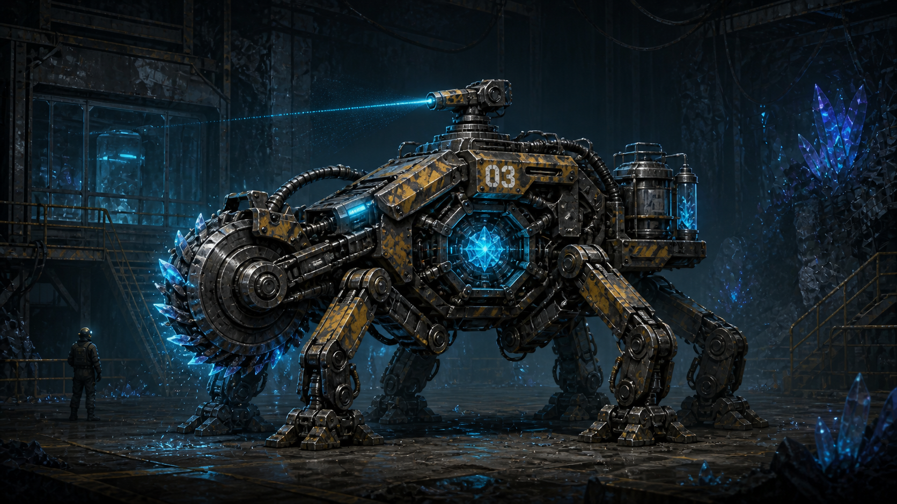

# 时间穿梭场景 Demo

这是一个运行在浏览器中的纯 Three.js 2D 白盒 Demo。

我们的目标不是现在就制作完整的人物、战斗或 Boss，而是验证一款 **Terraria-like 游戏**最重要的差异化体验：玩家能够破坏和改变场景，并通过时间穿梭亲眼看到这些行为在另一个时代产生结果。

## 项目目标

游戏最终方向是 Terraria-like：

- 二维横向世界
- 可探索、可破坏、可改变的场景
- 场景状态能够持续保存
- 过去与现代是同一个世界的不同时间状态
- 玩家在过去造成的变化会影响现代
- 时间切换必须快速、连续，并具有强烈的视听反馈

当前阶段着重验证三个部分：

1. **交互**：玩家如何移动、跳跃、拾取物品、打开背包并操作场景装置。
2. **场景**：同一地点如何保存过去与现代两套状态，并响应玩家造成的历史变化。
3. **时间穿梭表现**：切换时代时，建筑、色彩、粒子及屏幕效果如何连续过渡。

## 当前不重点考虑 3C

人物、武器和 Boss 目前仍是帮助测试关卡闭环的白盒实现，不代表最终美术与正式数值。

- 白盒角色负责移动、跳跃、拾取与消耗任务物品、格子背包、武器切换、攻击、操作装置和切换时间
- 03号闸门、机械手轮、时间锚背包和配重机构负责验证完整的跨时物品链
- 当前战斗验证平台跳跃、远程检修脉冲、射线预警和Boss核心命中；数值仍不视为正式平衡
- 暂不制作复杂敌人技能树、装备词缀和最终 Boss 数值
- 当前只实现满足场景验证所需的基础步行、跳跃和交互动画，正式角色美术后续替换

等物理、场景和时间穿梭体验成立后，再决定正式的角色与战斗方案。

## 当前最小实现

- 网页运行
- 纯 Three.js 渲染
- 固定二维正交视角
- 一个受重力约束的白盒角色
- 一个在2047年安装于闸门原位、可以拆下带走的03号机械手轮
- 一个按 `B` 打开的20格时间锚背包和10格快捷栏；任务物品使用后立即移出格子
- 一套由未来NPC预先交给主角的时锁爆破器与微型维修铣刀；初始位于快捷栏第0格，被主角暗装进2047年的门框锁轨后立即从背包消失
- 四种不消耗弹药的试验武器：可自由瞄准的时相枪、按住连续攻击的双手脉冲钻、像挥剑一样横向抡击的液压锤，以及投出后自动返回的开口扳手
- 武器固定占用快捷栏 `1 / 2 / 3 / 4`，机械手轮位于第5格，任务用时锁爆破器固定放在第0格
- 武器只在攻击及短暂战斗准备时间内拿在手中；待机时时相枪与扳手挂回腰侧，双手钻和液压锤背到身后
- 一扇在两个时间点位置与编号完全相同的03号闸门
- 一组2147年仍然存在、但缺少可拆卸手轮的绞盘、链条和配重机构
- 三个跨时代位置一致的矿场地标：左侧料斗—双辊破碎机—输送带、中央通风维修站、右侧03号闸门与深井巷道
- 贯穿三个区域的矿车轨道、装矿矿车、地下岩层剖面、矿脉和下层排水巷道
- 2047年的运转输送带、旋转风机、完整轨道和工作灯，以及2147年同位置的断带、停转风机、翻倒矿车、断轨、塌梁和瓦砾
- 角色采用带膝关节的粗块状肢体，以“抬腿—迈出—落地—换脚”四阶段步态移动，并保留手臂反向摆动、躯干起伏与影子变化
- 03号门后的跨时代升降机：2147年井口可直接看见空井、断缆、破门和井底残骸；2047年轿厢可双向乘坐并真实往返地面与地下层
- 地下实验室入口大门在2047年受权限锁死、2147年已经坍塌开放；玩家必须在井底切回现代穿过入口，再利用空间位置切回过去
- 比转运站稍大的地下实验室，由样本区、时间观察区、最终维护区、隔离观察室和Boss房组成
- 时间观察环右侧在两个时代都是同一张档案桌：2047年放着不能擅自翻阅的原始工单，2147年的残存终端则保存着维修员工号 `7C-113`、工单 `M-03-7721` 和“03号防爆门锁轨与密封检修”任务；玩家据此冒充当日外包维修员
- 2047年是03型时晶采掘机“掘脉者”永久封存日；维修工程师会介绍它沿矿脉行走、切取时晶样本的用途，并说明检修完成后舱门会灌胶，不再启封
- 官方工单只授权玩家维护防爆门锁轨与密封条，不包含任何爆破槽；黄色警戒线构成封存舱边界，强行越界会被工程师通过广播要求返回门边
- 实验室因果节点：玩家启动防爆门终检，使工作人员按安全流程撤入隔离室，监控转为只采集门体数据；玩家在完成合法锁轨检修时，用维修铣刀偷偷在锁轨背面加工暗槽，嵌入时锁爆破器，再以同色封板复原
- 玩家返回控制台后，工程师只验收门体开闭、锁止和密封数据；数据合格后立刻灌胶封存，之后一百年无人复检暗槽。2147年玩家从外部发送时间锚信号，使暗装爆破器沿预切轨迹从内部切断门框
- 扩建后的纵向Boss试验场：左右各有三级维护平台，玩家可以像走阶梯一样逐层跳跃；底层中央留给大型采掘机构
- 掘脉者是约主角2.5倍高的四足移动采样机，由四条关节腿、前置切晶轮、短样本输送管、后部样本舱、外露时晶核心和顶部测绘射线器组成，不再使用履带或坦克底盘
- Boss会在平台下方巡行并循环三种攻击：预警后发射时晶扫描射线、从腹部伸出脉冲钻刺向主角、跳向主角并砸地产生左右冲击波；机体本身仍无碰撞伤害
- 2047年与2147年两个固定时间点；玩家不能前往两者之间的任意年份
- 过去使用红色表现
- 现代使用白色表现
- `A / D` 左右移动
- `W` 跳跃
- `E` 拆卸、拾取、安装或使用场景装置
- `B` 打开或关闭时间锚背包
- `1 / 2 / 3 / 4` 分别装备时相枪、双手脉冲钻、液压挥击锤和回弹开口扳手
- 移动鼠标进行360度自由瞄准，角色会朝鼠标左右方向转身，持枪手臂与枪口同步旋转
- `J / 鼠标左键` 使用当前武器；远程武器沿鼠标方向发射，近战武器按瞄准方向完成劈砍或砸击
- `Q` 无缝切换过去和现代
- `R` 重置时间线

## Boss概念基准



概念图用于锁定“短体四足采样机”的轮廓、切晶轮、外露核心、样本舱和顶部射线器。实际2D模型会继续使用非像素的简化几何表现，并控制在约主角2.5倍高度，避免重新变成占满房间的巨型坦克。

## 核心体验

1. 玩家出生在固定的2147年，看见同一扇03号闸门因断电而锁死；绞盘主体和手轮仍在，但手轮已经严重锈死。
2. 玩家按 `Q` 前往唯一可达的过去时间点——固定的2047年；03号闸门仍因通电的电磁锁关闭。
3. 玩家在同一扇门的同一套绞盘上看到尚未锈蚀的完整手轮。供电灯、管线脉冲和门控面板明确显示主电网在线，因此手轮无法绕过电磁联锁开门。
4. 玩家靠近绞盘按 `E`，从闸门原位拆下手轮并放入背包。
5. 手轮进入受时间锚保护的主角背包。玩家按 `B` 可以查看手轮和它的来源时间。
6. 玩家按 `Q` 返回固定的2147年；由于手轮已经在2047年被拆下，现代原本锈死的手轮从闸门上消失，而完整手轮仍在背包中。
7. 玩家靠近现代闸门，第一次按 `E` 从背包取出手轮并装进空接口，第二次按 `E` 转动手轮。
8. 配重拉起大门，安全卡扣将其锁定，玩家穿过现代矿道并抵达升降机控制室。
9. 玩家在2147年发现矿井升降机轿厢已经坠毁，无法下降；切到2047年后，同一部升降机仍可运行。
10. 玩家乘2047年的轿厢沿真实电梯井下降到地下层，抵达后发现2047年的实验室安全门仍被权限锁死。
11. 玩家在井底切回2147年，穿过已经坍塌的同一扇安全门；进入实验室后可再次切回2047年调查正常设备。
12. 玩家在2147年发现Boss防爆门已经与墙体锈结，外侧无法安全施工；随后在残存档案终端找到维修员工号 `7C-113`、防爆门工单 `M-03-7721` 和具体检修项目。
13. 玩家回到2047年，向最终维护区工程师报出工号、工单号和“锁轨与密封检修”任务。工程师将主角当成当日外包维修员，并告知掘脉者今天完成最终断能测试后会被永久封存。
14. 玩家在身份核验后启动防爆门终检；工作人员按安全流程撤入隔离观察室，监控转为门体数据采集，防爆门进入维护开启状态。
15. 玩家进入门框内侧的合法维修位，按 `E` 完成锁轨检修，同时趁无人监看用维修铣刀在锁轨背面加工暗槽，嵌入时锁爆破器，再以同色封板复原。黄色警戒线之后仍是未授权封存舱，越界会收到工程师广播警告。
16. 玩家返回控制台结束终检。工程师只看到合格的开闭、锁止与密封数据，于是立即灌注封存胶；主角没有进入封存舱，暗槽又处于锁轨背面，因此之后无人发现。
17. 玩家切回2147年，在墙左侧接收器按 `E` 发送时间锚信号；爆破器沿主角当年铣出的轨迹从内部切断门框，门体向封存舱内部倒下。
18. 玩家越过倒塌门体后，掘脉者识别到时间锚并解除封存。它会在测绘射线、伸缩腹钻、跳跃砸地和双向地面冲击波之间循环。玩家利用左右三级维护平台改变高度，用四种武器攻击中央核心；主角可直接穿过机体，机体接触本身不阻挡也不受伤。
19. 需要返回时，玩家先在2147年穿过坍塌入口回到井底，再切到2047年，靠近完整轿厢按 `E` 上升。

这个过程要让玩家清楚感受到：

> 我不是切换了两张互不相关的地图，而是在穿梭同一个世界的时间，并亲手改变它的历史。

## 技术方向

过去和现代共享同一个世界标识，但每个可变化对象可以保存两套表现状态：

```js
{
  past: {
    transform,
    material,
    physicsState
  },
  present: {
    transform,
    material,
    physicsState
  }
}
```

跨时物品写入独立于世界时代的时间锚背包：

```js
playerInventory.handwheel = {
  sourceEra: 2047,
  timeAnchored: true
};
```

主角和背包属于时间锚，不随时代切换被重置；普通世界物体仍然读取各自时代状态。切换时代时不刷新网页，也不硬切场景，而是使用全局时间混合值连续插值：

- 位置、旋转和缩放
- 颜色与材质参数
- 灯光、雾和背景
- 粒子与残影
- 屏幕扭曲、色差和时间波纹
- 物理对象的激活状态

后续场景对象应逐步抽象为：

```text
基础场景状态
  + 时代差异
  + 玩家造成的历史事件
  + 时间锚背包携带物
  = 当前时代实际场景
```

## 下一步验证方向

- 引入 2D 物理引擎，使箱子和碎块拥有稳定的碰撞、重力和堆叠
- 增加手轮拾取动画、背包音效、手轮安装、链条绷紧、配重下落、大门升起和灰尘反馈
- 验证桥梁、支柱、门和地形等更多历史交互对象
- 让过去的移动、破坏和修复在现代产生不同程度的老化与坍塌
- 强化 Q 切换时的 Shader、残影、音效和镜头反馈
- 支持局部场景状态保存和重新加载
- 建立统一的历史事件与时代状态系统

## 当前仍不做

- 完整角色 3C
- 正式战斗平衡、复杂连招和完整受击动画
- 更多敌人、武器词缀与复杂 Boss 技能阶段
- 制作和成长系统
- 正式剧情、任务与对白
- 大型地图和完整内容量
- 联机与 Steam 接入
- 第三个时代

## 本地运行

项目包含本地 Three.js 文件，不依赖 CDN。使用静态文件服务器启动：

```bash
python -m http.server 5173 --bind 127.0.0.1
```

然后访问：

```text
http://127.0.0.1:5173/
```

## 当前 MVP 验收标准

- 网页能够在本地正常打开
- 玩家可以移动、跳跃并与手轮、绞盘和闸门交互
- 按 `Q` 时没有刷新或加载画面，两个时代连续过渡
- `Q` 只能在固定的2047年与2147年之间切换，不存在第三个可操作时间点
- 03号闸门在两个时间点最初都关闭，玩家不能从过去穿过后再切回现代绕路
- 2047年的手轮最初必须安装在闸门绞盘原位，而不是预先放在维修箱或地面
- 2047年的工作灯、供电节点、门框电轨和门控状态必须共同说明“主电网在线、电磁联锁锁定”
- 玩家靠近闸门手轮按 `E` 后，手轮才从过去机构上拆下并进入背包
- 按 `B` 能看到“03号机械手轮”、来源年份和时间锚状态
- 返回2147年后手轮仍保存在背包中；同位置原本锈死的旧手轮因历史被改写而消失
- 2147年第一次按 `E` 安装手轮，第二次按 `E` 转动它，大门才会实际升起并允许通行
- 两个时代必须保留相同的岩层轮廓、破碎机、通风机、矿车轨道、支柱坐标、管线路径、灯位和闸门机房；现代只表现这些物体的老化、断裂与废弃结果
- 玩家能够通过改变历史打开新的场景路径
- 玩家第一眼能理解“过去的行为改变了现代”
