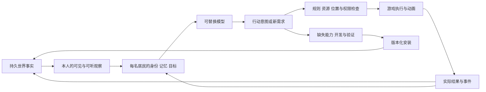

# 从零选择 AI × SAO 世界路线

调研日期：2026-09-09。决策前提：不计现有工程、已有提示词和沉没成本；优先满足“居民自主生活”和“可以逐步走向 SAO 的可进入世界”，并尽快交付能吸引协作者的可玩 demo。

## 结论

**建议主路线：Unity 6 + URP + VRM 二次元角色 + 独立于模型的持久世界内核；先做起始之城的一段高质量街区。** NPC 运行时优先试验 OpenGameAgent，世界规则、存档和能力定义由项目自己掌握。OpenGameAgent 未通过实测时，替换这一层即可，无须更换世界或引擎。

这个判断来自工具能力与集成边界的比较，尚未经过跨引擎实际开发工时或帧率对比。Unity 并非唯一能实现目标的引擎；它在本次“二次元人物、近距离互动、后续 VR、少量人完成首发”的组合条件下最值得先验证。[UniVRM](https://github.com/vrm-c/UniVRM)、[Unity Toon Shader](https://github.com/Unity-Technologies/com.unity.toonshader)、[XR Interaction Toolkit Examples](https://github.com/Unity-Technologies/XR-Interaction-Toolkit-Examples)分别提供现成的人物格式、卡通渲染与 XR 示例。

没有找到经过公开证据验证、下载后就同时具备“完整 SAO 场景、永久居民社会、任意需求自动开发、可靠持久化和 VR”的现成仓库。可以大量复用组件，但连接人物选择与真实世界变化的游戏规则仍需要开发。

**首发承诺应是：走进起始之城，认识几位会记住你、可以拒绝你、会改变身边环境的居民。** 先让这一承诺在小范围内成立，再扩展城市、野外和居民数量。

## 调研范围与证据

- [59 项 GitHub 候选目录](CATALOG.md)：按实际用途、可复用部分、缺口、许可证和采用优先级归类。
- [来源采集记录](repository_metadata.json)：保留公开 README/许可证来源、采集时间及所读内容的摘要哈希；不包含模型密钥。
- [采集脚本](collect_sources.py)：限定仓库名单、4 路并发、单请求超时与读取上限；不执行下载的代码。
- 这是覆盖主要技术路线的代表性调查，不能声称穷尽 GitHub 全部项目。通过官方仓库、文档、研究项目页核查；本轮没有安装、编译或运行这些候选。
- GitHub 公共 API 返回限流，因此没有用更新时间、星数或归档状态作排名。缺失元数据表示未知。文档、许可证及部分示例源码仍可读取。
- SimWorld Studio 出现搜索索引可读、后续 GitHub 直连及 raw 读取失败的情况，持续公开可获取性待复核；这会降低其作为首发基础的优先级。

## 1. 两个目标如何落实为产品

“每个 NPC 自主思想”在工程中意味着：各自的身份、偏好、目标、关系、记忆和有限观察，能够在多个可行行动中选择，协商、拒绝、改变计划，并承担后果。这些行为可以验证；主观意识不能由一次模型回答证明。

“SAO 世界”拆成三个可逐步兑现的层次：第一层的空间与二次元视觉；玩家与居民共享生产、交易、探索、战斗和建设规则；支持身体与空间交互的 VR 体验。软件项目可以沿这三层推进，不能据此承诺原作式全潜行感官技术。

两条迭代线同时存在：一条让玩家愿意走进去，一条让玩家走近后发现人物确实在生活。只做社会日志，缺少体验；只做景观，缺少世界持续变化的理由。

## 2. 五条路线的比较

以下是针对本项目的工程判断，不是测得的性能排名。所有路线都还需要项目自己的世界规则和永久存档。

| 路线 | 最直接的优势 | 主要新增工作 | 对本目标的选择 |
|---|---|---|---|
| Unity + UniVRM + NPC 运行时 | C# 游戏与角色运行时可共用语言；人物、卡通渲染、XR 有可组合组件 | 世界规则、场景美术、动画、感知和存档集成 | **主路线**；优先验证一个完整街区 |
| Unreal + VRM4U + 独立 NPC 服务 | 场景、地形、光照、PCG 和大世界工具；SimWorld 可参考 | 人物风格统一、服务桥接、插件版本、构建分发 | **强备选**；更重视高规格环境时可上升为主线 |
| Godot + godot-vrm + Terrain3D + NPC 运行时 | 引擎本身 MIT，代码可控；有 VRM、地形与 XR 组件 | 角色/渲染/动画整合和具体内容仍需搭建 | 若“引擎也必须完全开源”是硬要求，优先选它 |
| Minecraft + Mindcraft/Voyager | 已有可操作的采集、合成、建筑世界，适合先试行为 | SAO 美术、战斗和近距离人物体验需要大幅转换 | 最快的行为实验室；不作为最终视觉产品底座 |
| Web + Three.js/three-vrm + Colyseus | 链接传播和观察入口方便，可做 3D 人物 | 游戏编辑、动画、世界内容与持久语义仍需建设 | 用于网页入口/观察器；浏览器优先时另行成为主线 |

组件依据：[VRM4U](https://github.com/ruyo/VRM4U)、[UE PCG](https://dev.epicgames.com/documentation/en-us/unreal-engine/procedural-content-generation-framework-in-unreal-engine)、[Godot](https://github.com/godotengine/godot)、[godot-vrm](https://github.com/V-Sekai/godot-vrm)、[Terrain3D](https://github.com/TokisanGames/Terrain3D)、[Mindcraft](https://github.com/mindcraft-bots/mindcraft)、[three-vrm](https://github.com/pixiv/three-vrm)。

不会为了证明“重新思考”而预先搬迁现有项目。正式选择引擎前，先在干净样板中完成下文第 0 步；本报告本身不授权迁移或删除旧工程。

## 3. 最值得借鉴的项目与采用方式

| 项目 | 我会借什么 | 不应预期它直接解决什么 |
|---|---|---|
| [OpenGameAgent](https://github.com/EricSun0218/OpenGameAgent) | C# 游戏 Agent 运行时、独立角色调度、图像/记忆输入、动作回执 | 世界玩法、成套 SAO 资产和生产成熟度；当前仍为 alpha |
| [Generative Agents](https://github.com/joonspk-research/generative_agents) | 记忆、反思、计划的组织方式 | 可直接发布的 3D 游戏与长期存档迁移 |
| [Concordia](https://github.com/google-deepmind/concordia) | 人格组件、社会互动、意图与情境裁决的区分 | 引擎物理、库存结算、建筑实际施工 |
| [AI Town](https://github.com/a16z-infra/ai-town) | 可观察的多人世界、异步对话与记忆演示 | 完整自主生产/建设；部分活动选择仍由规则或随机逻辑驱动 |
| [Mindcraft](https://github.com/mindcraft-bots/mindcraft) / [Voyager](https://github.com/MineDojo/Voyager) | 可执行动作、失败反馈、技能复用 | 凭空创造游戏还没有的机制；它们依托 Minecraft 已有能力 |
| [CUBE](https://github.com/echo-yiyiyi/cube) | Unity 中的居民日程、相遇交流和模拟记录 | 开箱即用的 SAO 社会与永久产权/施工系统 |
| [SimWorld Studio](https://simworld.org/simworld-studio/) | 生成场景后，用引擎检查与视觉反馈修正的流程 | 本轮尚不能保证完整源码/资产可复现；定位也偏具身训练环境 |
| [AgentSociety](https://github.com/tsinghua-fib-lab/AgentSociety) | 社会实验和群体行为研究方法 | 直接游玩的二次元城市；注意当前主线与旧版城市模拟的区别 |

OpenGameAgent 的 [引擎接入文档](https://github.com/EricSun0218/OpenGameAgent/blob/main/docs/engine-integration.md)目前描述 Unity 6、Godot .NET 与 UE sidecar，但也明确引擎适配主要以 Windows 编辑器验证为目标。因此必须补上**打包运行、重启、动作结果未知后的恢复**实测。它的 [示例代码](https://github.com/EricSun0218/OpenGameAgent/blob/main/examples/OpenGameAgent.Example/Program.cs)展示模型调用受限移动工具及回执，并非已经实现了居民城镇；示例使用内存动作账本，不能直接当永久存档照搬。

## 4. 我会实际采用的最小组合

| 层 | 第一版选择 | 引入条件与边界 |
|---|---|---|
| 客户端 | Unity 6、URP | 锁定与人物和 XR 包共同验证的版本；先 Windows 桌面 |
| 人物 | VRoid 制作基础人形 + Blender 精修 + UniVRM/MToon | 身份、体型与服装源文件由项目保存；VRoid 是制作工具，不是假定存在的无人值守 API |
| 场景 | 一套统一的模块化建筑/植物构件 + Blender | 自有或允许分发的资产；至少完成一栋可进入样板和一条完整街道 |
| NPC 运行 | 小范围试用 OpenGameAgent，包在项目自有接口之后 | 未通过第 0 步则换薄 C# 模型/工具适配层；不改世界数据格式 |
| 世界事实 | 纯 C# 领域规则 + SQLite 事务存档 | 保存人物、物品、关系、承诺、事件、能力版本；引擎负责物理与动作完成确认 |
| 日常执行 | NavMesh + Animator + 少量状态机 | 走路、搬运、播放动画无需每帧请求模型；动作复杂后再评估 GOAP |
| 模型 | 可更换的云 API，事件驱动调用；本地模型是后续可选项 | 不把模型名字、人设或全量历史硬编码到引擎角色类中 |
| 语音与表情 | 可替换语音接口 + uLipSync | 先测少量角色的语音延迟、口型和视线，字幕交互始终可用 |
| 新资产 | 先用 Blender 模块与脚本；复杂单件可接 3D 生成 API | 生成后仍需比例、UV、材质、碰撞、连接点与动作语义检查 |
| VR | OpenXR + XR Interaction Toolkit | 桌面近距离互动通过后接 PCVR，再单独评估移动头显 |
| 多人 | 第一版保留共享世界接口，暂不叠加全套多人后端 | 第二名真人接入时，在 Mirror/Nakama 等方案中按职责选择 |

人物/语音来源：[VRoid Studio](https://vroid.com/en/studio)、[VRM Blender Add-on](https://github.com/saturday06/VRM-Addon-for-Blender)、[uLipSync](https://github.com/hecomi/uLipSync)。Unity Toon Shader 与 MToon 可以按场景/人物分别选择，不应假设把两套材质直接叠上就会统一风格。

第一版无需同时装入 LangGraph、Concordia、AgentSociety、Mem0、Graphiti 和多个网络后端。它们解决的问题有重叠；新增依赖必须对应已经出现的缺口。

另外，[NVIDIA Game Agent SDK](https://github.com/NVIDIA/game-agent-sdk)已经有共享一个本地模型的多角色示例、工具调用与 RAG，值得列入本地推理备选。当前官方条件包含 Windows、Ampere 或更新 NVIDIA GPU 与 CUDA；这些条件会限制首发参与者设备范围，因此不把它设为所有玩家的必要依赖。[Inworld 的 Unity 角色交互模板](https://dev.docs.inworld.ai/Unity/runtime/demos/primitives/character)和 Convai 则可用来比较语音产品体验，但使用其服务不意味着世界长期状态已由我们掌握。

## 5. 自主居民怎样连到真实世界

每人有独立的决策状态，可以并行调用同一个模型服务，不需要每人加载一份模型权重。影响同一物品或同一土地的动作，在提交时解决冲突。

观察包含 NPC 自己的摄像头图像、同一视野下识别到的对象、可听见的事件，以及本人已经知道的事实。感知层必须处理距离、遮挡和消息来源；世界数据库里“有这件事”不等于该居民知道。视觉判断用于评价外观、布局和可见变化，物品归属、余额与操作结果依靠可信状态。

世界事实与人物解释分开保存：交易是否发生、谁有物品是事实；“他讨厌我”是人物可能出错的判断。记忆检索是可重建索引，不能成为存档唯一载体。

模型选择有时会更差，升级并不自动保证世界更好。项目应保存真实行为样例，比较新旧模型能否延续身份、未完成委托和已知信息；结果退步时可以换回。这样升级成本主要落在接口、评测与局部行为修正上，已发生的历史无需随模型删除。

## 6. 无限扩展需要三种不同的工作

| 居民提出的需求 | 处理路径 | 完成标志 |
|---|---|---|
| 再买一把已有的椅子 | 已有物品的生产/交易与放置 | 钱物实际转移，椅子可坐 |
| 将已有墙、屋顶、桌椅组合为新院落 | 约束下的构件组合与施工 | 入口可达，材料消耗正确，居民能使用 |
| 世界还没有的保鲜、契约或新交通机制 | 需求证据 → 设计审核 → 暂停/隔离开发 → 测试 → 存档迁移 → 安装 → 回访 | 原人物在原存档成功使用，第二人也能复用 |

审核应考虑世界观、真实需求、现有能力能否满足、工程成本和玩法收益。模型自报的置信度只是一个信号，不能独自决定功能是否真实可用。

NPC 负责提出生活意图与使用反馈；开发 Agent 获得明确的工程任务。日常人物不能直接把任意生成代码写进运行世界。允许暂停开发意味着可以逐步扩展能力；它不等于所有新机制都能在一轮推理内完成。

## 7. 首个让人愿意加入的 demo

暂名：**“起始之城：我们回来后，他们还记得。”**

空间范围建议为一段约 150–250 米的可步行街区，包含广场边缘、酒馆、作坊、住宅与通向城外的小路；远处用城墙、楼群和层顶轮廓建立大世界感。这个尺度是项目设计提案，不是原作地图测绘。远景中暂不可进入的区域应可辨认，不能冒充已模拟的全城。

初始 6 名永久居民：例如旅店经营者、木匠、商贩、探索者、厨师和邻居。角色有自己的资源、住处、经历及相互矛盾的小目标；职业只是起点，不能把他们写成只会接命令的功能按钮。初次展示不靠大量装饰 NPC 冒充真实社会。

### 玩家看到的 8–12 分钟

1. **前 30 秒：空间与人物。** 玩家从城门方向走入街区，看见统一的二次元人物、错落的屋顶、植物、布帘和开门营业的人；镜头能走近，角色面部与走路不露怯。
2. **第 1–3 分钟：独立意愿。** 与一位居民交流，尝试提出合理或不合理的请求。居民根据资源、好感与当前目标接受、讨价还价或拒绝。
3. **第 3–8 分钟：可见后果。** 在资源和机会已存在的情境中，居民可以协商、采购、搬运、制作或改变空间。玩家可以协助，也可以袖手旁观，后续选择不同。
4. **第 8–12 分钟：世界连续性。** 保存重启；居民记得已发生的交往，物品位置和承诺保留。可在开发演示中切换另一模型继续同一件未完成的事。

一个候选测试情境是“酒馆外的聚会受到雨天影响”。居民可以选择改期、借室内空间、租用已有棚架，或提出新设施需求。**天气与可用资源是设置的情境，解决方案由居民选择；不保证一定造棚，不将预写结局冒充涌现。** 首发视频从真实运行里选择有代表性的片段，注明种子、版本和发生了什么。

真正缺失的新能力，单独展示“提出需求—开发安装—回到原世界使用”的完整记录。若开发用了较长时间，展示真实时间跨度或标注剪辑；不要把编辑器魔法出现一个模型称作 NPC 已完成施工。

### 二次元美术的明确方向

- 人物：动漫比例、清晰的眼睛与发型轮廓、2–3 级明暗、稳定面部阴影、克制描边；近距离有眨眼、看人、转身、口型和手部持物。
- 场景：石砌城墙、灰泥与木构立面、连贯的屋顶语言；用层数、进深、店面、庭院、招牌、植被与使用痕迹形成区别。
- 光照：明亮的环境填充、可读的阴影、统一曝光与色彩；控制高光、过黑阴影和过强泛光。具体材质仍以打包后的街区画面验收。
- 模型生产：先有一套精修构件，再批量组合变化。AI 生成用于特定缺口和草稿；风格一致性、骨骼、UV、碰撞和可使用性由资产流程保证。

## 8. 按一次 AI 工作可交付的规模拆分

每步都产出可审阅结果与明确证据；失败先修复这一边界，不立即扩张任务。步骤不是未经测量的工期承诺。

| 步骤 | 单次工作范围 | 必须交付与通过的验收 |
|---|---|---|
| 0A 人物与渲染选型 | 干净 Unity 场景导入一个 VRM，调光、脸部与行走 | 打包后与编辑器一致；近景/中景两段实机录像；锁定版本 |
| 0B NPC 运行时选型 | 一个角色通过候选运行时执行两个受限动作 | 真实模型调用、有效动作、非法动作被拒绝；超时后不重复执行；打包可用 |
| 1 永久人物与存档 | 3 人、少量物品、身份与事件存储 | 冷启动后身份与产权不变；这一步无须增加大型记忆框架 |
| 2 第一套美术样板 | 酒馆外立面/室内入口、人物尺度、照明、植物组合 | 玩家可走近和进入；建筑与动作位置对齐；形成可复用构件与风格说明 |
| 3 一条街与活动空间 | 用已有样板组合街道、住宅、作坊和城外入口 | 道路可达、空间有用途、构图清晰；相机行走展示完整 |
| 4A 本人观察 | 摄像头图像、遮挡、可听事件与知情边界 | 角色能观察自己所在空间；看不见/没被告知的秘密不会进入上下文 |
| 4B 选择与执行 | 协商、拒绝、取物、搬运和交付的小动作集 | 有多种有效选择；实际钱物/位置变化与模型描述一致 |
| 5 同一件事影响下次决定 | 3 人完成或拒绝一件事务，再次相遇 | 经历可检索且影响后续行动；保存重启后仍成立 |
| 6 换模型接续 | 用第二个真实模型继续同一份存档 | 未完成事项接续；不清空历史；记录行为、延迟与费用差异 |
| 7A 从实测选择扩展需求 | 收集居民提出的缺口，选择最小且合理的一项 | 需求来源、替代方案、批准依据和可验收使用场景明确 |
| 7B 实现并安装该能力 | 一个有界功能或资产组合，含数据迁移 | 原档安装、实际使用、第二居民复用、失败可回退 |
| 8 扩到 6 人并录制 demo | 加入剩余居民，补语音/视线/必要动画 | 不同真人输入下运行；冷恢复、失败恢复和成本记录可查 |
| 9 协作发布准备 | 整理代码、可分发资产、样例存档与小任务 | 新机器照 README 跑通；视频、运行包和开源代码版本一致 |

第 0A/0B 先完成，再正式锁定 Unity 与 NPC 运行时。若引擎人物链路不通过，拿同一角色和动作测试 Godot 或 UE；若仅 Agent 包不通过，替换 Agent 包。不能把局部适配失败变成整个项目重写。

## 9. 对外协作需要什么

GitHub 首页展示一个约 60–90 秒的实机片段：走入城市、人物拒绝/协商、环境真实变化、保存后继续。再提供一个可下载演示与对应源码版本。

贡献入口按可独立验证的对象组织：一个建筑构件、一种持物动画、一个世界动作、一个模型适配器、一个行为回归案例。人物/物品/能力有稳定 ID，资产清单注明来源与版本。能力用统一接口注册，避免给每个居民编写特殊分支。

提供两种运行入口：免密钥的明确标注回放，方便先看画面和安装；自带 API 密钥或本地模型的真实自主运行，验证行为。二者在 UI 和 README 中区分。维护者承担费用的在线演示应通过服务器控制额度，不在客户端分发密钥。

公开发布时，代码许可证、引擎条款、素材许可、模型权重许可分别登记。Unity Toon Shader/XR 示例采用 Unity Companion License；自制或可分发素材让协作者能完整运行项目。使用原作视觉参考不等于默认可以分发原作游戏提取素材。[Unity Toon Shader 许可](https://github.com/Unity-Technologies/com.unity.toonshader/blob/master/LICENSE.md)、[Quaternius Medieval Village](https://quaternius.com/packs/medievalvillage.html)。

## 10. 这条路线的长期价值与限制

能够沉淀的是人物历史、关系、真实事务、世界规则、模块资产、使用反馈与评测证据。模型和工具可以替换；世界数据与既有作品拥有独立生命期。

仍可能需要迁移存档、修正早期规则、重做较差资产和调整行为。更强模型也可能遗忘细节、理解偏离或成本更高，所以持续评测和版本回退是长期维护的一部分。“模型升级不会迫使世界从零开始”是可设计并验证的目标；“以后永远不返工、所有升级都会更好”无法保证。

下一项最有价值的实际工作是完成第 0A 与 0B：**一个值得走近的二次元居民，在打包游戏里通过真实模型做出一次可验证的动作。** 这会给引擎与运行时选型提供第一份实际证据。
