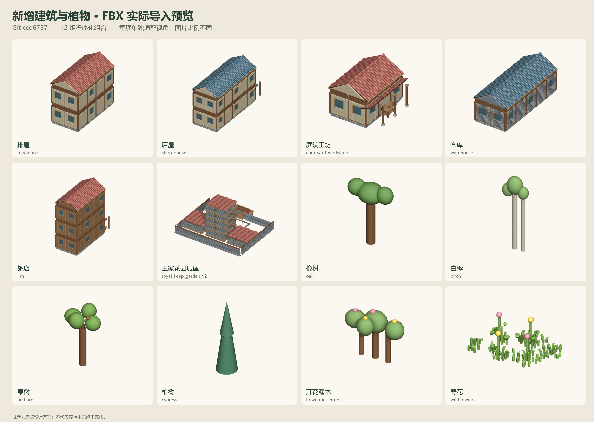

# Git 全部模型 FBX 导出

- 版本：`ccd675705a4e71bfa828066ab9df02642c7e3d94`，分支 `codex/town-growth-20260907`。
- 主文件：[ThreeHearths_All_Git_Assets_ccd6757.fbx](ThreeHearths_All_Git_Assets_ccd6757.fbx)，约 120.4 MiB。
- 367 个模型条目/源场景版本；不是 367 个互不重复的原创模型。
- 138 份 GLB、19 份 Blender 源场景版本、198 个 Git 中的 UE 网格（186 静态网格、12 骨骼网格），以及 12 组当前代码生成的建筑/植物组合。
- 同一模型的 GLB、UE、Blend 表示分别保留，按来源分组；所有对象可独立选择。
- 实际米制尺寸，分类分行陈列，没有统一缩放。UE 的大型水面等网格也包含在内，全景尺度较大；浏览单项时选择其命名根节点并框选聚焦。

## 新增组合

排屋、店屋、庭院工坊、仓库、旅店、王家花园城堡、橡树、白桦、果树、柏树、开花灌木、野花。

## 保留与限制

保留模型几何、UV、可转换的常规材质/贴图、顶点颜色与骨骼。Unreal 的程序化材质图、游戏逻辑、存档、音频、动画片段、说明图等不属于此模型合辑；它们仍保留在 Git 项目中。原始 Blend 场景的摄影地板、相机、灯和隐藏辅助物未放入 FBX；源文件保持原样。

647 个生成材质从同名 GLB 源材质恢复颜色、粗糙度和金属度。11 张角色/工具源贴图已嵌入 FBX。UE 水面、地形等程序化材质需在目标软件重建；运行时水面环境采样器没有对应的静态贴图。

城堡包含完整设计方案的 1,319 个网格部件（1,276 个源模块，植物展开为多个网格），不表示游戏存档已经完成施工。

## 验证

重新导入最终 FBX 后，逐条核对根节点、网格数、三角面数、UV、骨骼数和包围盒，全部通过。

- 网格对象：3,593
- 三角面：6,720,969
- 骨架：12，骨骼总数：123
- 文件 SHA-256：`92499806492eaa59c70d7774495136d8f1d540e0c0eab244bc707b141b60c140`
- [完整模型索引](ThreeHearths_All_Git_Assets_ccd6757.json)
- [重新导入验证报告](FBX_Validation.json)
- [ThreeHearths_All_Git_Assets_ccd6757.blend](ThreeHearths_All_Git_Assets_ccd6757.blend) 是同场景的 Blender 可编辑副本。

导出期间未调用付费模型 API，未改写游戏存档，未开启定时任务。

## Git 下载

大型 `ThreeHearths_All_Git_Assets_*.fbx` 和配套 `.blend` 使用 Git LFS。克隆仓库后执行 `git lfs install` 和 `git lfs pull`，取得完整二进制资源；网页上的 LFS 文本指针不能直接导入 Blender。
