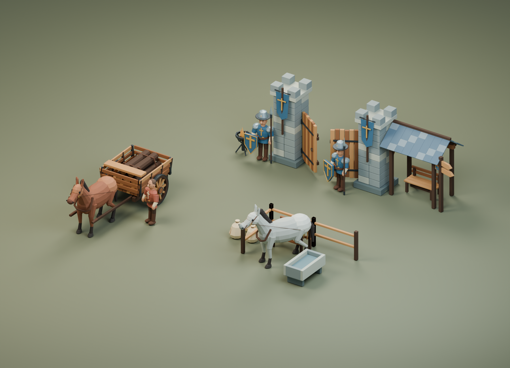

# Medieval Life · 中世纪公共生活样板

主代理亲自制作、渲染并检查的 Blender 样板，延续 OrganicVillageMasters 的暖木、灰石、灰蓝屋顶和可拆分构件路线。当前 21 个资源模块，3 个组合样板；两种马毛色共用同一套形体，不能算作两套独立建模。

预览是 **Blender 源资产渲染**，不是游戏内功能完成的证据。

## 模块清单

| 类别 | 资源 ID | 用途 |
|---|---|---|
| 马车 | cart_body / cart_wheel | 独立车架和车轮，轮轴原点支持转动 |
| 货物 | cargo_logs / cargo_sacks | 可装卸的原木、扎口麻袋；不能凭空赋予游戏库存 |
| 马匹 | horse_bay / horse_grey | 棕马、灰马；马具为可移除附件层 |
| 人物 | royal_guard_body / carter_body | 卫兵、车夫的静态人物样板 |
| 装备 | guard_helmet / guard_shield / guard_spear | 钢盔、盾、长矛独立构件和挂接点 |
| 门楼 | gate_pier / gate_leaf / royal_banner | 可调整门距，单扇门以门轴为原点 |
| 站岗休息 | watch_shelter / watch_bench / watch_brazier | 遮雨棚、长椅、可分离火焰的火盆 |
| 马厩设施 | stable_rail / hay_rack / water_trough | 2 米栏杆、草架、水槽 |
| 路边 | road_signpost | 使用图形符号的路牌 |

`Assemblies/` 中分别是载货马车、国王门楼岗哨和围栏马厩角。`Modules/` 中 GLB 保留 structure / finish / attachments / weathering 等实际存在的层，以及语义材质、米制 UV 和锚点；不要假定每个模块都有四层。

`MedievalLife_Masters.blend` 保存完整可编辑层级。`create_medieval_life.py` 与 `meshkit.py` 可重新生成。原始单位米、Z 向上、正面 -Y；Unreal 导入转换必须与现有村庄保持一致，避免重复做厘米缩放。

## 当前验证与后续

- 2026-09-08 首次生成：21 个模块 GLB + 3 个组合 GLB，4 张真实渲染 PNG；主代理检查了总览、马车和门楼近景。
- 已实际导入 Unreal：45 个独立层 StaticMesh、108 个材质槽；独立冷加载检查 UV、Nanite 关闭、旗帜双面材质和坐标尺寸全部通过，最大坐标误差约 0.000012 厘米。证据为 `UE_Import_Report.json` 与 `UE_ColdAudit.json`。这证明资源可被引擎加载，不代表 NPC 或运输已经接入。
- 导入日志对部分小装饰面报告了近零切线/法线；目前无贴图法线，后续骨架与贴图工作前需进一步清理这些小面。
- 马匹已另存为可编辑的 18 骨骼版本，棕马/灰马各有 Idle 与 Walk；原始静态模块保留。源网格变形、蹄底接触、循环闭合和四个FBX冷导入通过；Unreal 的6个分层SkeletalMesh、2个Skeleton、4个AnimSequence也通过独立冷审计，详见 `Rigged/README.md`。游戏内牵引/货运尚未接入。卫兵和车夫人体目前还是静态样板，没有坐姿或人体绑定。
- 布料与火焰是静态样板；暂无布料模拟、燃料消耗和火光组件。
- 材质为便于跨软件的 PBR 色块与独立附件，没有烘焙纹理、专用 LOD 或碰撞壳。
- 游戏接入由单独的导入索引、真实运行截图和行为记录验收。职责、访客、库存守恒与思考调度代码的单元测试不能代替完整游戏验收。
