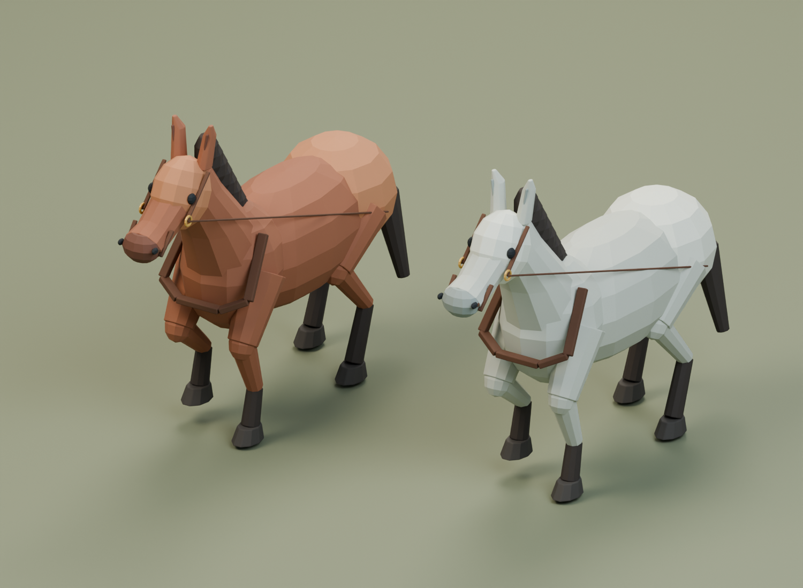

# 马匹骨骼与动作

主代理在 Blender 中为原有棕马、灰马样板制作的骨骼和动作。两种毛色共用相同形体及动作设计；不计为两套独立造型。

- `Medieval_Horses_Rigged.blend`：两匹马，各 18 根骨骼；形体、毛色细节、马具仍是三个可拆分网格。
- `horse_bay_idle.fbx` / `horse_grey_idle.fbx`：30 fps，1–61 帧，2 秒呼吸/头颈轻动循环。
- `horse_bay_walk.fbx` / `horse_grey_walk.fbx`：30 fps，1–37 帧，1.2 秒四拍步行循环。
- 同名 GLB 保留 skin 与当前动作，方便跨软件审阅。
- 行进方向为源文件 -Y，单位米，Z 朝上。游戏需要以 **0.6 米/秒**移动 actor，与原地踏步动画对应；动画不包含 root motion。

`rig_horses.py` 可从原始 masters 重建绑定与动作。`audit_horse_deformation.py` 独立加载保存的绑定文件，通过 Blender 依赖图评估实际的 bevel + armature 变形网格，检查每帧蹄底不穿地、站立脚落在原始 1.5 厘米接触基准、首尾闭合，以及接触期蹄部相对 actor 的速度。它修正过初版“完整步幅被压缩到接触期导致滑步”的问题。

检查报告：`rig_report.json` 是创作端运动学目标检查；`deformation_audit.json` 是保存后真实网格变形检查；`fbx_roundtrip_audit.json` 是四个 FBX 独立冷导入后对 18 根骨骼、实际 skin 权重、UV、材质、2 秒/1.2 秒动作、变形和米制尺寸的检查。这些不能替代引擎内的最终运行验证。

`Previews/` 六张图是 Blender 对不同步行相位的真实渲染。尚无小跑、转身、套车/卸套和受力拉车动作；人体、车轮联动及真实货运需分别接入。原有 45 个静态资源与三套组合样板未被这些导出覆盖。

## Unreal 原生导入

2026-09-08 已实际导入并在独立 UE 进程冷加载验收：6 个分层 SkeletalMesh、2 个 Skeleton、4 个 AnimSequence。每个 Skeleton 是 18 根创作骨骼加 1 根导入的对象根骨；每层真实 reference bones 和每个动作的 19 条轨道均完整，Idle/Walk 的实际采样、数值姿态变化、30fps、材质和厘米尺寸通过。原生高度268.5000厘米，与源一致。

`Content/ThreeHearths/Data/MedievalLifeHorseRigCatalog.json` 提供实际引擎资源路径。导入目录 `/Game/ThreeHearths/Generated/MedievalLife/Rigged`。Blender 单动作 FBX 的 stack 名为 `Scene`，所以 Idle 的资产名可能是 Scene；Walk 放在独立 Walk 子目录避免覆盖。游戏应按 catalog 的 clip key 加载。

证据为 `UE_Rigged_Horse_Import_Report.json`、`UE_Rigged_Horse_Audit.json`。UE 的 FName 不区分大小写，动画轨道可能显示 `fl_upper`，骨架显示 `FL_upper`，它们代表同一骨骼。冷审计按该规则逐层/逐动作验收，没有降低缺骨门槛。

这证明原生骨骼资源与动作完整可加载；实际游戏内步态、地形接触、马车牵引和运输结算仍需运行验收。
