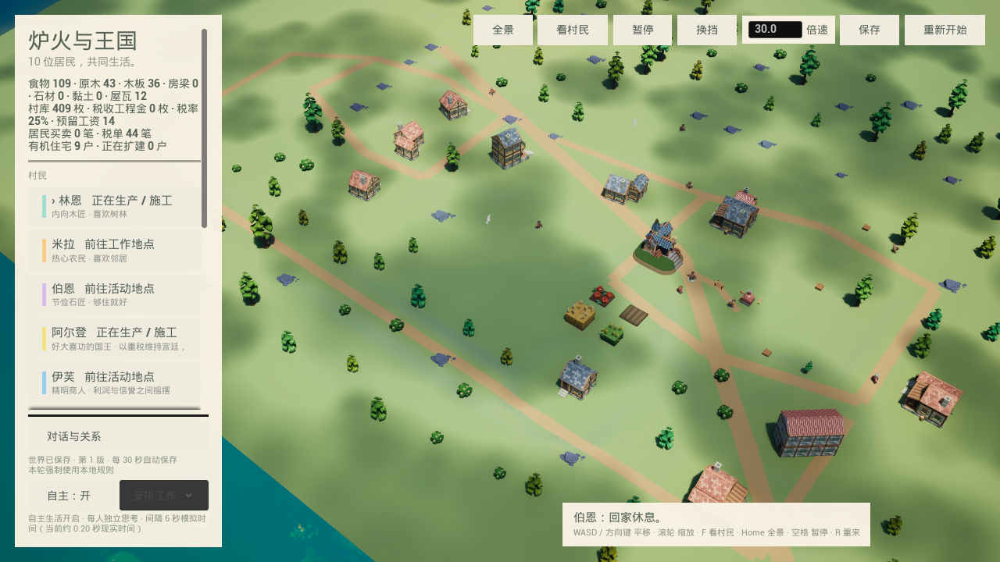

# 本轮运行验收

2026-09-08。这里的 PNG 来自 Unreal 游戏视口；未对截图重绘或提亮。

- 10 名居民，9 户使用新 Blender 构件住宅；国王保留原有住宅和税收公共工程系统。
- 28 种源构件、114 个分层原生模型、3 种配色；开局住宅明确属于初始房产。
- 最新规则的新村庄实际运行约 55 分钟模拟时间。托马斯和塞琳从 35 件的小家扩为 50 件的侧翼住宅；伯恩保留 35 件的小屋。新增构件通过真实材料与钱包结算，记录 30 笔公共建材采购。
- 旧世界在代码修复后继续运行；世界 ID 保持一致。材料生产恢复，米拉完成 86 件院落；原先因站位被覆盖而卡住的伯恩和梅芙能够再次进食、休息和工作。
- UE 5.8 编译成功；完整回归 79 项通过，其中 6 项带测试警告。最终规则、生活费保护与施工恢复的相关 2 项检查再次通过。
- 新构件全部 297 个材质槽存在；关闭这些低面数运行构件的 Nanite，未修改引擎共享资产。
- 本轮使用 `HearthDisableApi`，调用数量为 0；没有把本地规则结果写成 Kimi 决策。

`validation.json` 保存前后状态和检查摘要。原始检查点、历史、日志与独立相机诊断图位于项目的 `Saved/ThreeHearths/OrganicReview/`；可运行 `../tools/summarize_runtime_review.py` 重新汇总。

目前仍是可继续开发的运行版本。婚育、任意跨类型重建、更多职业建筑、完全由居民形成的聚落布局以及室内导航尚未完成。独立的一次性 SceneCapture 会把背光面拍暗，暂以游戏视口作为画面验收依据。

从项目根目录运行 `Launch_OrganicVillage.ps1` 可打开离线村庄；普通启动保留存档，`-FreshPreview` 仅查看临时新场景。
