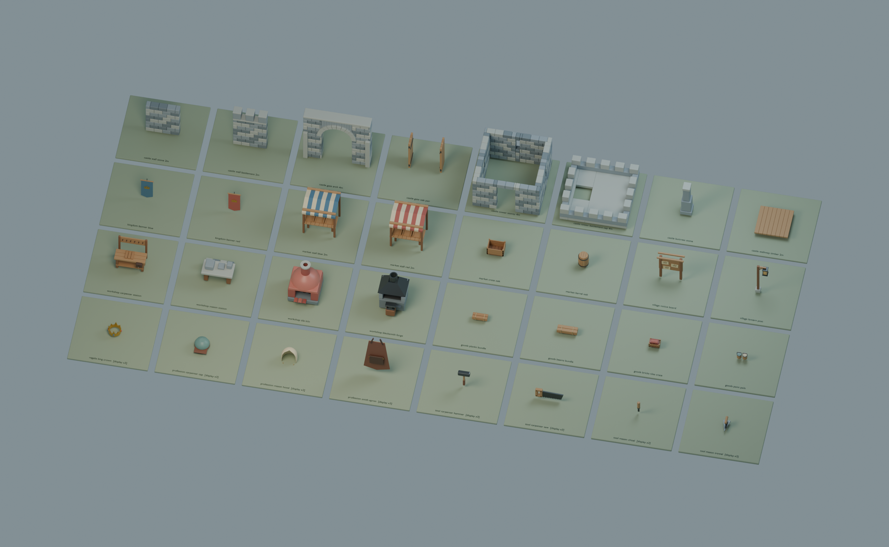
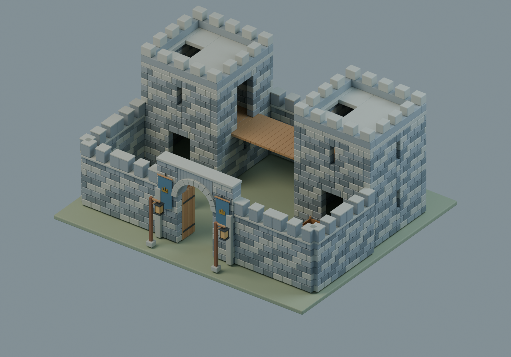
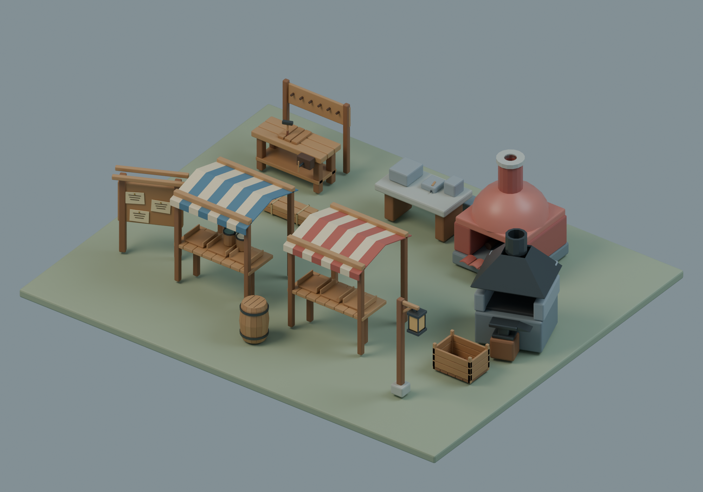
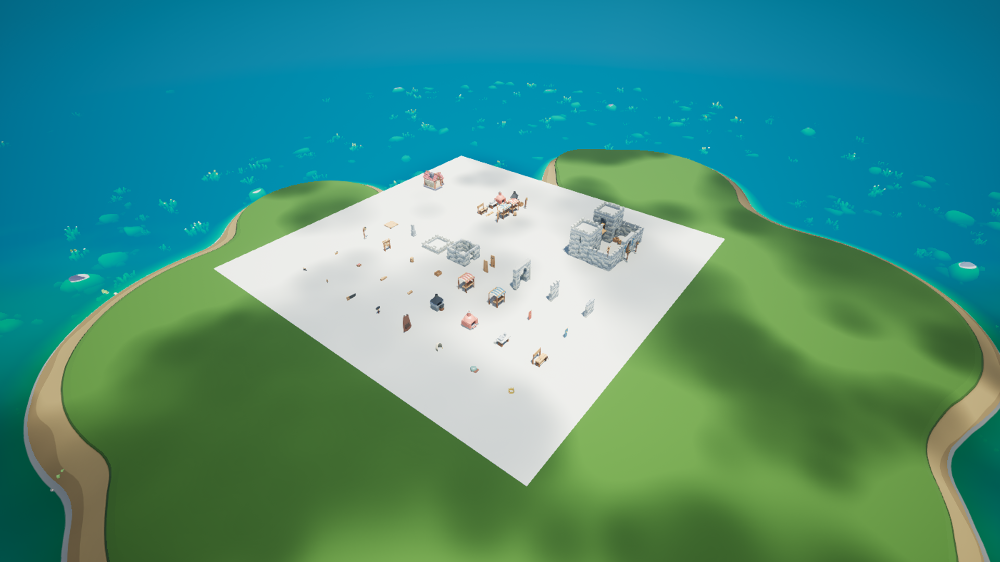
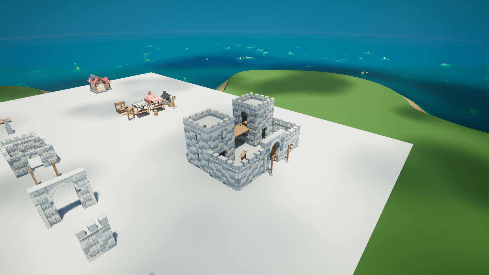
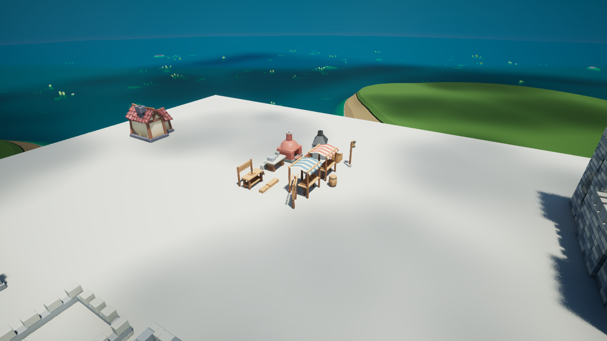

# SocietyKit — 城堡、街市、工坊与职业配件

首批 32 个原创组件用于扩展 ThreeHearths 的中世纪十人社会场景，沿用 VillageKit 的奶油灰泥、暖木、蓝灰石材、陶瓦和厚边比例。实际模型由专用 Blender MCP 会话执行本地脚本生成；旧 VillageKit 的 38 个组件未修改。

## 组件与语义

| 分类 | 内容 | 预期用途 |
| --- | --- | --- |
| 现场结构 | 2m 石墙、垛墙、4m 真拱门、空心塔楼层段、塔顶、扶壁、木步道 | 材料运抵后在现场安装 |
| 城堡/街道附件 | 开门状态的双扇门、两面王国旗、箱、桶、告示牌、路灯 | 归属、交易、公告和公共空间的可视资产 |
| 市集与工坊 | 红/蓝摊位、木工台、石工台、瓦窑、锻炉 | 职业生产和市场的设施外观候选 |
| 可搬运商品 | 木板包、梁材包、砖瓦箱、涂料桶组 | NPC 搬料与商品库存的模型 |
| 身份附件 | 皇冠、木工帽、石工兜帽、铁匠围裙 | 静态职业/身份附件，含配戴锚点约定 |
| 工具 | 锤、锯、凿、抹刀 | 可搬运/持握道具，尚无角色绑定或动作 |

整座城堡和整个市集都是装配方案。塔楼层段、墙段和工作台属于现场安装结果，不是 NPC 单手搬走的物品。



总览中的职业附件和工具以 **3 倍展示比例**放大并标注；独立 GLB 和机器规格始终保留实际米制尺寸。

## 两个组合方案

`kings_gate_courtyard`：真拱城门、两座按 2.4m 逐层叠加的塔楼、垛墙、上层木桥、旗帜和街灯。塔楼上层的门朝向木桥，桥面标高与门槛相同；屋顶保留舱口。



`guild_market_yard`：两个摊位与木工、石工、烧瓦、锻造设施共享的小型行会市集，配材料包、告示牌、箱桶和灯。



这些是视觉装配候选。尚未实现角色职业绑定、库存、生产、归属、社交互动、城墙梯道、塔楼内楼梯、碰撞体或 NPC 寻路。不能据预览图宣称 NPC 已能生产、交易或登上城墙。

## 接口与材质

- 米制，源文件 +Z 向上、正面 -Y，2m 网格；GLB 按标准转为 +Y 向上。
- 普通墙宽 2m、厚 0.4m、层高 2.4m。塔楼占地 4×4m、壳体厚 0.35m。
- 城门净宽 1.8m；塔楼门净宽 1.1m，塔顶有 1×1m 真开口。窑炉与锻炉的工作口有实体空间。
- 皇冠和帽子以头部接触面为局部 Z=0；围裙以颈部挂点为原点，向 -Z 下垂。它们是静态模型，不含角色骨骼。
- 复用 VillageKit 的 PBR 色系。陶瓦粗糙度 0.34～0.40、金属度 0；铁与金色金属分别使用实际金属度。所有组件都有 UV；不依赖 Blender 专属程序纹理。

完整约定在 `module-specs.json`。真实 bounds、三角数、材质与文件大小在 `model-report.json`。`example-layouts.json` 与组合 GLB 从同一份 placement 列表生成。

## 文件与复现

- `modules/*.glb`：32 个独立网格，带材质、法线、UV、语义元数据。
- `examples/*.glb`：两个组合方案。
- `SocietyKit.blend`：完整源组件库及总览。
- `SocietyKit_kings_gate_courtyard.blend`、`SocietyKit_guild_market_yard.blend`：两个可编辑组合场景。
- `create_society_kit.py`、`society_geometry.py`：完整本地建模源；几何基础函数由本项目自己的 VillageKit 源码独立复用，无需执行或修改旧库。
- `render_society_kit.py`：分别渲染 `modules`、`castle`、`market`。
- `validate_society_kit.py`：导出文件与真实开口的独立检查。

```powershell
& 'D:\SteamLibrary\steamapps\common\Blender\blender.exe' --background --python .\create_society_kit.py -- --no-render
& 'D:\SteamLibrary\steamapps\common\Blender\blender.exe' --background --python .\render_society_kit.py -- castle
python .\validate_society_kit.py
```

也可在专用 Blender MCP 会话中用 `runpy.run_path` 执行同一脚本。生成脚本会清理该 Blender 会话的场景，因此应使用项目专用进程。生成与单张渲染分开调用，避免单次 MCP 超时。

验收文件 `validation.json` 直接检查 GLB 结构、UV、单位法线、退化三角形、每件 20k 三角预算；射线检查城门、塔楼、舱口及炉口，另用实体墙命中作为阳性对照。`render-report.json` 记录真实渲染耗时和分辨率。

`artifact-manifest.json` 记录当前冻结 GLB 的 SHA256。重复导出时 Blender/glTF 内部排序可能变化，因此生成脚本可重建相同的几何与材质，但不承诺二进制文件逐字节相同。

## UE 导入与 NPC 目录

主线程已将32组件及2组合导入 `/Game/ThreeHearths/Generated/SocietyKit`，34件材质槽、源文件哈希、32件尺寸和34处直立摆放检查通过。独立审阅地图为 `/Game/ThreeHearths/Maps/L_SocietyKit_Showcase`；保留原村庄灯光并放置Cropout原房屋供对比，地图不运行居民。`UE_Import_Report.json`、`UE_Showcase_Report.json` 记录实际原生结果。







`catalog.json` 区分可搬运库存批次、单件现场安装、多安装建筑计划。楼层/墙段/工坊为现场安装任务；木板、梁、瓦片、涂料包装只代表已有库存，不凭模型生成商品。两份组合各有31与16个实例，保留每件材料清单。目录中的数值是未应用的平衡草案，当前所有运行绑定仍标为待接入。

项目脚本 `Plugins/ThreeHearths/Tools/import_society_kit.py` 可按已验证源文件续导；`create_society_kit_showcase.py` 新建独立地图并验证尺寸与方向；`society_kit_catalog.py` 重建离线执行目录。三个脚本均不调用付费服务或变更世界库存。
