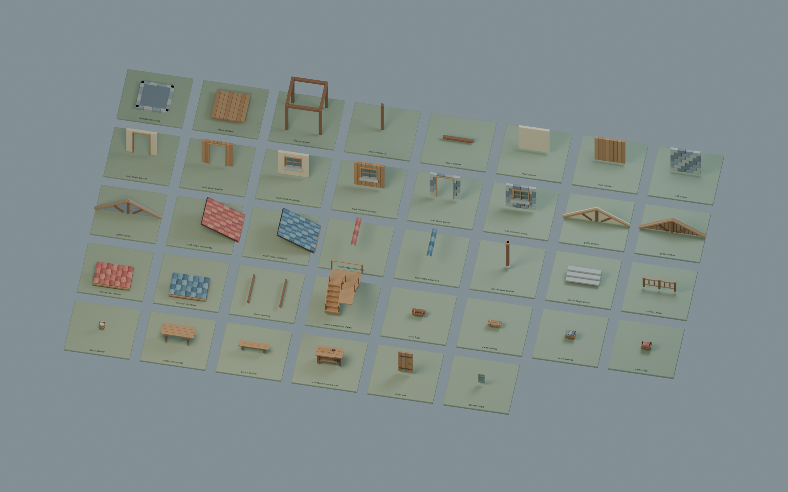
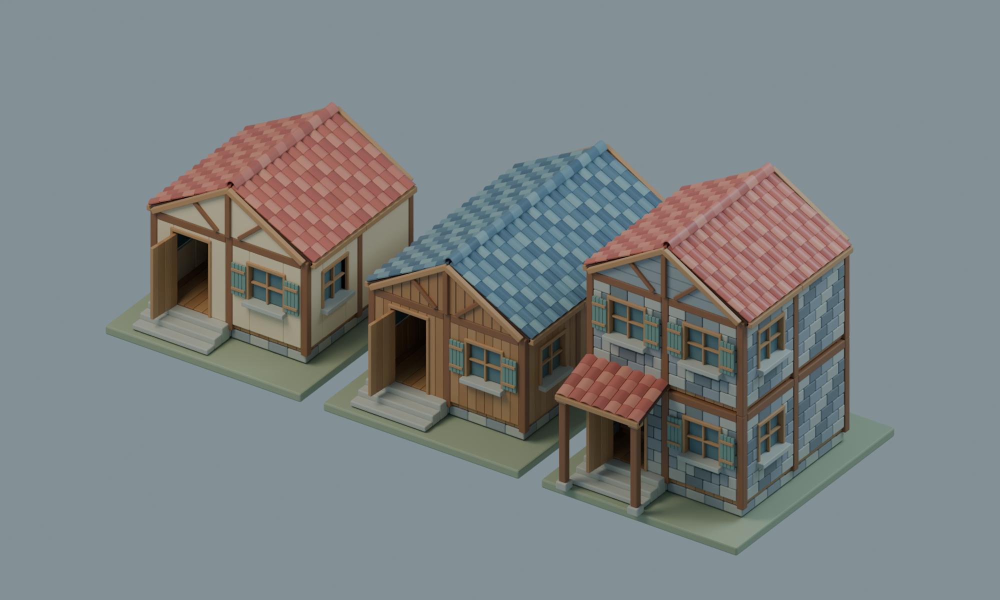
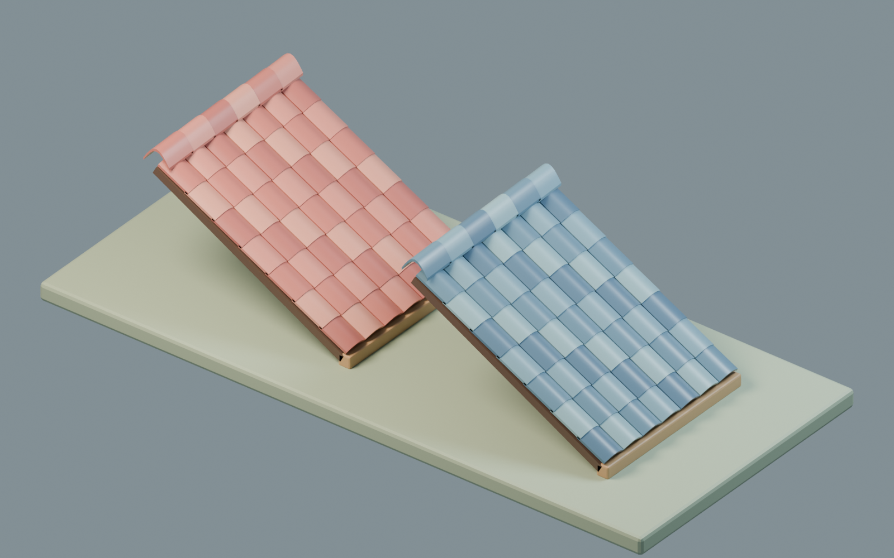
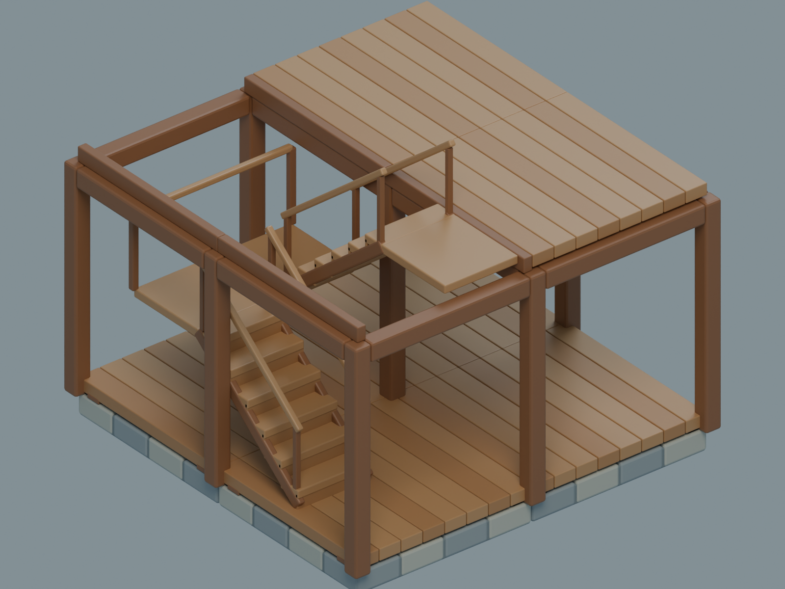

# Village Kit — 首批村庄建筑与施工组件

这批资产补充 ThreeHearths/Cropout 村庄的模块库。38 个独立组件可组成灰泥小屋、蓝瓦木长屋、石砌双层房；房型、墙材和屋瓦可以分别选择。可搬运的最小单位是木材包、木板包、石料箱、瓦片箱和灰浆桶。地基、柱梁、墙和屋顶是在现场完成施工后出现的结果；整层、整房属于组合配方。

这是一批实际通过 Blender MCP 生成并导出的原创模型。没有调用外部模型生成、购买资产或使用 Blender 专属程序材质。建模源、独立 GLB、装配变换和渲染脚本均在此目录。

## 画风与瓦片处理

实看 `Art/HearthCottage/HearthCottage_InUE.png` 和 `Docs/Validation/PIE_Import_Cottage.png` 后，沿用原村庄的奶油灰泥、暖木、厚石基、鼠尾草窗板和夸张圆边比例。瓦片改为连续弧面：8 段曲面使用平滑法线，端面与侧面保留硬边，瓦身有真实厚度。红陶、蓝灰各有 4 个轻微色差/粗糙度变体，粗糙度分别为 0.34/0.38/0.36/0.40，陶瓦金属度为 0。

UV 存在于每个组件。重复瓦片复用相同局部 UV 参数；PBR 参数可直接导出到 glTF。当前没有贴图型污渍、磨损或雕刻纹理，因此视觉一致性来自形体、轮廓、材质颜色和高光；这些组件仍适合继续迭代细节贴图。







## 拼接约定

机器可读约定在 `module-specs.json`；实际范围、面数和材质在 `model-report.json`。

| 类别 | 约定 |
| --- | --- |
| 坐标 | 米制，Blender +Z 向上，正面 -Y；GLB 标准转换为 +Y 向上 |
| 网格/层高 | 2m 网格，结构层高 2.4m；楼板面高于结构基准 0.16m |
| 地基 | 原点是顶面中心，向下延伸 0.24m |
| 柱梁 | 柱在网格顶点、梁在网格边，各放一次；独立框架只作单格施工原型 |
| 墙 | 以格子边界中心为原点，实际填充宽 1.82m；两端让出柱位 |
| 屋顶 | 4m 总跨，半片朝 +X 下坡；原点在墙顶标高，屋脊位于局部 Z=1.2m；沿 Y 每 2m 拼接 |
| 搬运物 | 5 类材料包是可携带件，其余建筑组件和设施需要现场施工/放置 |

双层房使用 `stairs_switchback_2x4m`，占左侧连续两格。踏步高 0.20m、进深 0.24m；转角平台和上层出口平台深 0.90m。上层用两件两端开放的 `floor_opening_2m`，并省略穿过楼梯井的首层中间横梁。顶部出口平台与右侧楼板相接。



楼梯属于几何装配候选。图和规格并不代表 UE 碰撞体、寻路、NPC 上下楼或实际施工状态机已接通；这些需要引擎中的单独验收。

## 文件与复现

- `VillageKit.blend`：38 个局部坐标模型、PBR 材质库与组件展示。
- `VillageKit_Examples.blend`：三种已装配房型的可编辑场景。
- `VillageKit_RoofStudy.blend`：屋瓦材质近景场景。
- `modules/*.glb`：每件一份独立网格，带材质、法线、UV 和语义元数据。
- `examples/*.glb`：三个完整房型；与 `example-layouts.json` 使用同一份装配列表生成。
- `create_village_kit.py`：确定性建模与导出；默认同时渲染，`--no-render` 跳过渲染。
- `render_village_kit.py`：单独渲染 `modules`、`houses`、`roof` 或 `construction` 视图。

```powershell
& 'D:\SteamLibrary\steamapps\common\Blender\blender.exe' --background --python .\create_village_kit.py -- --no-render
& 'D:\SteamLibrary\steamapps\common\Blender\blender.exe' --background --python .\render_village_kit.py -- houses
```

Blender MCP 可以在专用空白会话中用 `runpy.run_path` 执行同一脚本。脚本清理该 Blender 会话内的场景后重建组件，因此应使用本项目专用的建模进程。单次 MCP 运行建议生成时传 `--no-render`，然后逐张渲染。首批实际环境为 Blender 5.2.0 LTS。

独立导出检查由项目 `Plugins/ThreeHearths/Tools/validate_village_kit.py` 执行，结果在 `validation.json`。它直接检查导出文件，而不是只检查 Blender 内部对象：GLB 结构、材质/UV/单位法线、退化三角形、面数预算及屋瓦平滑/粗糙度。施工目录和引擎接入的状态以项目级验收记录为准。
