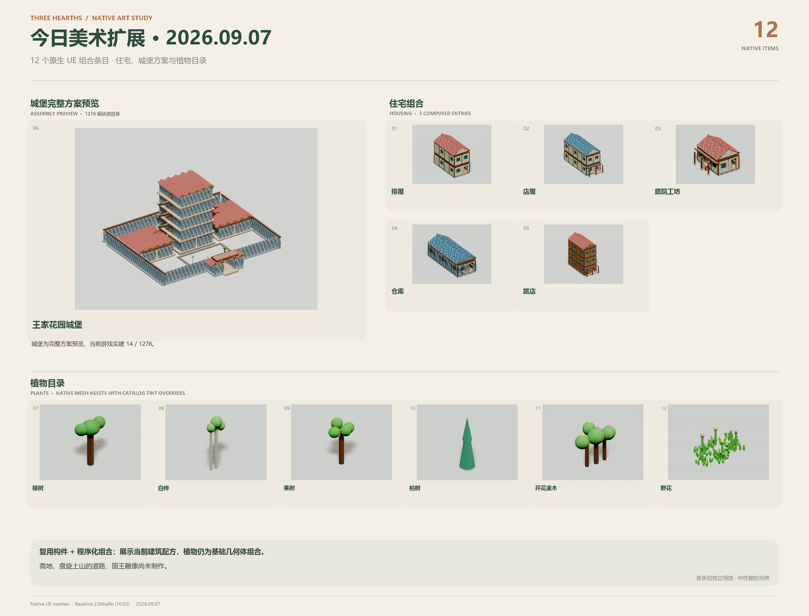

# 2026-09-07 白天美术扩展记录

这张图展示当前代码中新增的 12 个组合条目：排屋、前店后宅、带院作坊、仓库、旅店、王家花园城堡，以及橡树、白桦、果树、柏树、开花灌木、野花。它们使用项目中的实际 UE StaticMesh、材质与原生生成规则；截图使用独立临时摄影场景。

对比当天 10:02 的远端基线 `2366a8b`，157 份模型源文件（138 GLB、19 Blend）中没有新增或变化的 GLB；3 份已有 HearthCottage Blend 源文件有字节变化。因此这是一份复用构件与程序化组合的增量目录，不能称作今天新建了 12 份独立模型。已有 138 项模型全览另见 [完整美术目录](Art_Models_Overview.png)。

## 实际状态与限制

- 城堡显示 `royal_keep_garden_v2` 全部 1,276 个源模块、13 个阶段的方案；植物源模块会展开成多个网格。最后一次真实世界验收只完成 14/1,276，国库剩 2 金币。该预览没有改写存档、免费发放资源或推进施工。
- 住宅截图为各用途一组确定性参数的生成结果。植物仍然主要由基础几何体组合，尚未达到完成后的城市美术品质。
- 国王的高地、盘旋上山的道路与巨型雕像尚未制作。模型交付后自动施工并产生储物等功能的通用闭环也未完成。
- 每个条目按自己的边界适配相机，图片之间不是统一比例尺；摄影光照与游戏内光照不同。材质和几何没有通过图片生成工具重绘。

## 再生成

先编译 ThreeHearths 编辑器模块。用 UE Python commandlet 执行 `Art/export_daily_art_catalog.py`（`-nullrhi -run=pythonscript -script=<完整脚本路径>`）；它调用 `Hearth.ExportArtCatalog`，将清单写到 `Saved/ThreeHearths/ArtCatalog/catalog.json`。

然后用独立 UE 编辑器执行 `Art/render_daily_art_catalog.py`（`-d3d11 -RenderOffscreen -ExecutePythonScript=<完整脚本路径>`），始终加 `-HearthDisableApi -HearthNoWorldPersistence`。可加 `-DailyArtOnly=oak` 做单项检查。脚本只创建临时场景，不保存地图或修改原始资产，完成后关闭自己的编辑器；批量运行应由父进程加 240 秒超时并记录、回收所启动的 PID。

全部 12 张完成后，用装有 Pillow 的 Python 执行 `Art/compose_daily_art_catalog.py`。输出本页 PNG 和同名 JSON 索引。渲染中间产物在仓库根的 `.codex-ue58-diagnostics/daily-art-20260907/`，不随源码上传。

本次导出器编译通过；渲染与排版使用真实网格，逐张检查后交付。此次整理不调用 Kimi。
