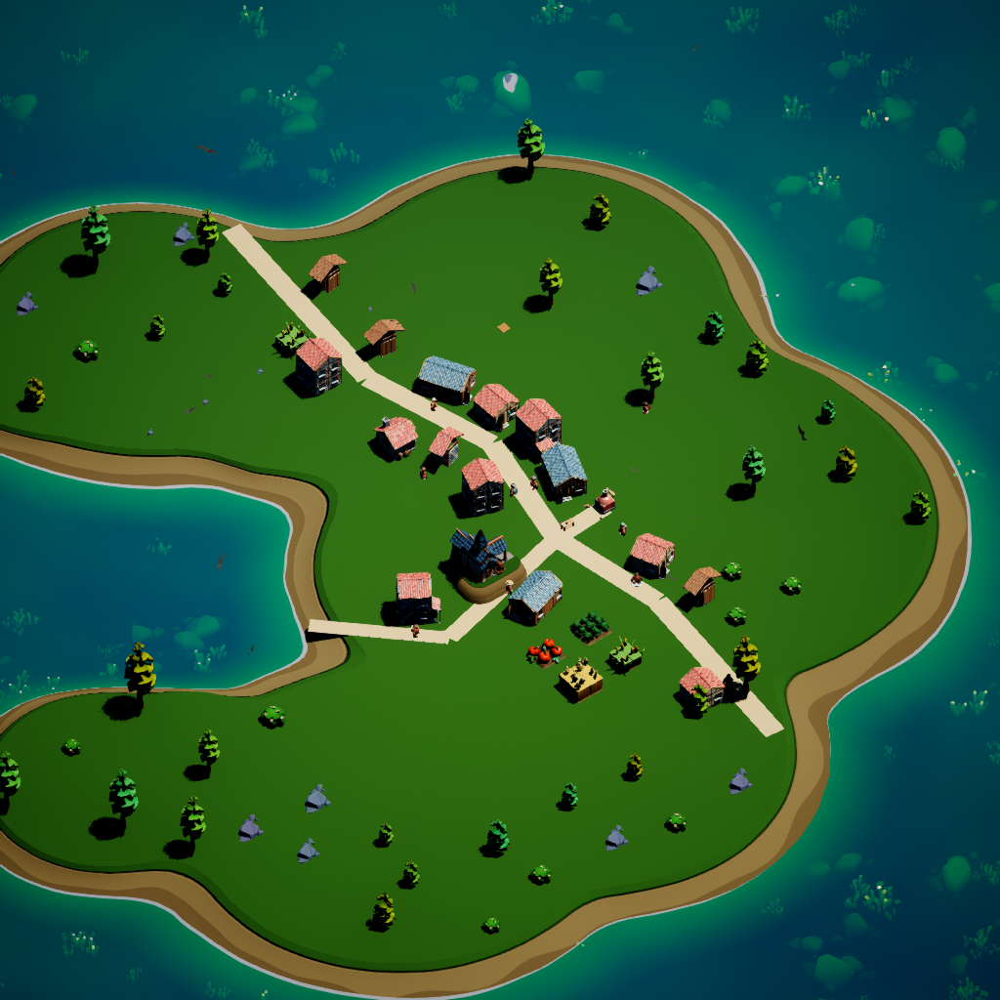

# 从独立地块到连续街区

2026-09-07。本轮把初始住宅布局、生产点表现、个人选址和房屋计划连接起来。三名 Luna 分别完成选址偏好、住宅用途和地表表现，主任务负责审查、集成、寻路与存档修复、UE 实景验收。

## 游戏中的变化

| 环节 | 当前实现 |
| --- | --- |
| 连续地表 | 移除生产点统一的方形底板和黄色宅地边框；农田保留用途需要的泥土和原作物模型，底土改用重叠的小椭圆片。 |
| 初始街区 | 新世界的十处初始住宅位置从共享弯折道路生成，带不同退距和朝向，并检查地形及间隔；门口和行走入口一起朝向街巷。 |
| 每个人选址 | 木匠、陶工、农民等参考真实工作点；商人参考市场；社交与安静偏好参考个人目标、实际朋友和公共区域。没有真实工作点时使用普通偏好。 |
| 个人住宅计划 | 把个人目标与选址理由记录到计划；用途意向影响房间数量和标签，新计划最多三个房间，空间或资金不足时尝试缩小。已有未完成施工保留优先级。 |
| 可走的空地 | 未施工的空地、已开垦土地不再形成无形围墙；实际建筑、施工计划和公共工程仍保留占地避让。 |
| 重启稳定 | 修复场景初始化误读存档校验外壳的问题；保存住宅位置、门面朝向与布局版本，冷启动使用同一街区。 |

“皇城订单目前尚未发生”等叙事不会凭空建立客户、家庭成员或工作站，也不会让所有人自动获得相同的市场选址偏好。房间的“作坊”“院落”等用途标签仍是规划意向，不能当作完整的新行业玩法已经存在。

## 如何看到新布局

打开本项目 `CropoutSampleProject.uproject` 中的小镇地图并运行。已有世界继续保留原来的建筑坐标；要体验新街区，使用游戏中的 **重新开始**（快捷键 **R**）。这一操作会先归档旧世界，再生成新一轮居民、房屋和库存。单纯载入旧存档不会自动搬动已有房屋。

## 验收记录

最终验证见 [机器验收记录](Validation/Continuous_Neighborhood_Acceptance.json)。原生测试覆盖十户入口可达、空地穿行、施工占地、个人偏好、有限资源、旧布局主动重开和存档朝向；实景验收使用独立世界，没有注入个人目标，也没有调用外部 API。另起一个 UE 进程冷加载同一存档，比较世界 ID、全部宅地、布局元数据和计划构件。

UE 5.8.2 编译成功，46 项原生测试通过（40 项无警告，6 项带警告，0 失败）。85 秒实景中，10 户初始住宅全部完成，国王、学徒、商人、织工又建成 4 处模块住宅，64/64 构件完成；四份计划都保存了个人目标和选址理由。这次实景中的四份计划均为单房间，多房间能力只在原生测试中得到验证。

冷启动的数据一致性检查在 DX12 与 DX11 下都通过。DX12 两次在编辑器退出阶段返回 `0xC0000005`，延后退出也未消除；DX11 复测正常退出（退出码 0）。根因尚未确认，本轮没有更改项目默认图形后端，也没有把 DX12 退出稳定性标为通过。`-nosound` 验收另有原蓝图的 Audio 空引用和部分资产的 Nanite 材质使用标记警告。所有本轮测试 UE 进程及三个工作代理已退出。

## 尚未完成的自治环节

目前保留十户初始名额和现有房屋素材；后续模块住宅可以由居民选择位置、组织目录中的构件并真实施工，但仍受候选位置、地形、道路和资源规则约束。道路还没有由长期人流动态生长。居民的日常饥饿、休息、生产、交易和社交仍沿用现有系统，本轮没有把整套生活重新写成开放式模拟。

个人初始目标当前由本地人设模板提供。本轮验证证明本地决策与施工链路可执行，不是 Kimi 自发思考或看图评审的证据。缺失美术资产可以进入上一轮的需求队列并导出委托，但尚未自动启动 Luna/Blender、导入新模型并让提出者复核；这仍是下一段需要完成的闭环。

每轮 600 次 API 上限与原累计预算规则不变。本轮没有调用收费模型，没有提交或推送仓库。
