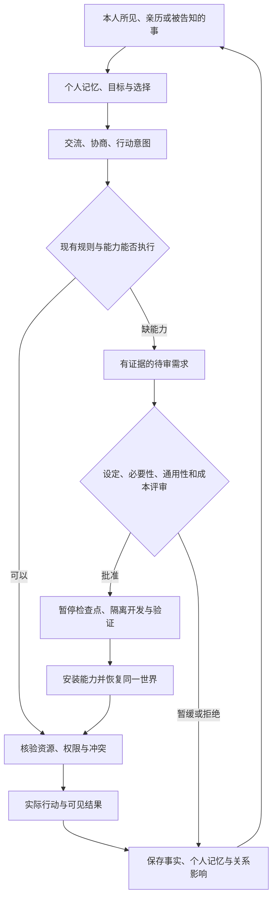

# 持续世界路线评审：同一个世界如何随着 AI 成长

2026-09-08。用户要求三名子 Agent 独立提出方案并交叉反驳。本记录由主代理综合两轮实际回复形成；属于路线决策建议，不是新增功能的验收报告。三方基于同一项目证据讨论，不构成三个独立实验，也不能证明找到了唯一最优解。

**建议下一阶段交付：在现有 SAO 第一层存档的一条街上，让三位固定居民发生一件玩家看得见、世界保存得住、会影响下一次选择的事情，再验证替换决策模型后能够接着生活。** 保留另十位居民的身份与档案，按通过的机制逐步激活。无需重开世界或再次更换题材。

## 目标与需要修正的假设

长期方向保持为 SAO 艾恩葛朗特第一层、起始之城、二次元人物与环境、最终可进入的 VR 世界。旧国王、税收与中央高地城堡路线继续归档。原作未确定的细节仍按项目补全记录，不把自行创作当成原作事实。

可工程化追求的是：人物身份、生活经历、关系、财产与世界变化持续积累，模型、代码和美术能够分批替换，替换后继续同一段历史。不能保证任意新模型都会更合适，也不能保证未来产品竞争不会淘汰某种实现；旧代码和资产允许重做，已经发生的生活需要能迁移。

无限迭代指可以持续延长历史和增加能力，不要求每一分钟都扩地图或生成新资产。有限预算、有限活动区域和有限居民同样可以构成持续世界。暂时没有新需求、合作失败、改变主意和保持现状，都是可成立的生活结果。

SAO 的空间、生活、冒险和社交体验可以作为逐步验证的方向；永久运行、主观意识及动画中的完全潜行体验，不能由当前 Demo 或一次模型升级来保证。

## 当前事实

依据现有[执行计划](Starting_Town_Iteration_Plan.md)、[样板街验收](../Validation/StartingTown_2026-09-08/README.md)，并窄读 `HearthAincradResidentRuntime.cpp` 的动作白名单与实际提示词：

| 已有基础 | 尚不能据此声称完成的事情 |
| --- | --- |
| 同一世界、13 个持久居民身份，已激活艾琳、拓真、柏木 | 13 人已经形成持续运行的社会 |
| 三人实际行走、本人视野、独立 Kimi 请求 | 已经具备交易、合作、生产或自主施工 |
| 12 栋开发者搭建的建筑，三处可进入一楼 | 建筑由居民需求与施工自主生成 |
| 四个动作：到岗位、等待、观察、提出需求 | 提出的愿望已经被处理和兑现 |
| 追加历史和有界短期记忆 | 长期经历已经被检索并影响选择 |
| 自由飞行相机；二次元人物源文件继续积累 | 玩家步行、人物实机替换、后处理及 VR 已验证完成 |

这里的跑偏主要是交付顺序：视觉、资产数量和 API 调用被反复当成“世界活起来”的进展。美术需求本身合理，但社会机制的缺口没有随之闭合。主代理此前跟随局部需求推进，也应承担没有及时调整验收重点的责任，不能归因为用户想得太多。

## 三方博弈及取舍

| 子 Agent | 第一轮主张 | 接受其他方反驳后的修改 | 保留的分歧 |
| --- | --- | --- | --- |
| A / Tesla：世界连续性 | 稳定物品、产权、结算、历史先成立，模型只提交意图 | 接受职业可转移；不再预设谁接单和成功；把玩家可见交付纳入验收 | 不支持在生活闭环前投入 VR 优化 |
| B / Bernoulli：自主社会 | 用资源、信任与技能形成分工，允许拒绝和失败 | 接受先做极小交易内核；加入玩家可见的使用结果 | 反对固定建筑者/生活者人群，也反对把可靠执行工单等同于自治 |
| C / Lorentz：SAO 体验 | 从人尺度和第一人称看见因果，避免只有后台正确 | 接受有限资源、拒绝和缺货分支；暂缓完整 VR 与人物精修 | 不接受只交付后台数据正确、玩家仍看不懂发生了什么 |

主代理裁决：先完成极小数据基础，把它与玩家可见的一次事件合在同一轮交付，不把它们拆成两个长期阶段。职业作为初始技能、工具与场所倾向，后续可以学习、转移职责或转行；当前无需先写学习系统，也不增加专为造世界服务的新居民。

关于 VR，采用有界试验：第一条生活闭环后、大规模扩城前，做实际设备上的小场景适配与性能、舒适度检查。现在的街段先校准成人眼位、碰撞、交互距离与可读性。完整 VR 系统和整层扩建均不能成为当前主线。若没有设备，只记录未验证，桌面帧时间不能代替 VR 验收。

三方都倾向于拒绝新模型带来的突然性格改变。这里还需修正：不能因自私居民偶尔善意就判定动作无效，否则会再次写死人物。身份、过去发生的事实、权限和资源是硬约束；性格表现是跨多次选择评估的倾向。允许矛盾和成长，对持续无依据的趋同或漂移限制模型上线；不要由主持模型逐条强制写回预设剧情。

## 世界中的生活与世界外的开发

每位居民都可以发现问题、想办法、交流和提出需求；职业影响他能做什么、如何看待事情，不决定他唯一能想什么。承接委托的居民也应保留自己的生活目标，可以没有时间、拒绝低价或找人合作。

图中是职责边界，当前用现有 UE 模块、版本化状态、动作处理与资产清单即可，不要求建立许多服务或重写整个引擎。

技术开发使世界获得“可以制造或使用某物”的能力；实际制造、付款、占地、交付仍是世界中的行为。开发者生成一个货架模型，不代表居民已经拥有货架、材料自动减少或旧库存凭空增加。NPC 没资源或技能时，后台可以准备候选能力，不能直接送出建成事实。

需求审批至少区分三种情况：已有能力可以解决，居民需要自行协商执行；真实能力缺口可以排入开发；只是愿望、误解或暂时不适合的扩张，保留记录但不自动实现。置信度是建议，不是批准凭证；一次独特但重要的需求也可能值得实现，不机械要求多人重复提出。

世界共享事实与个人认识分开保存。某人说“他偷了我的工具”首先是说话事件及个人判断，除非有实际转移证据，不能直接变成全世界公认的盗窃事实。居民只能使用自己的视野、亲历和明确收到的信息；主持者知道全局，不代表每位居民知道。

## 模型升级时必须保住什么

| 必须有连续性的内容 | 可以替换的实现 |
| --- | --- |
| 世界与居民 ID、出生档案、已发生事件、关系与承诺 | 模型供应商、模型版本、提示词组织方式 |
| 物品和建筑实例 ID、产权、位置、库存、用途 | 网格、贴图、材质、动画、导航实现 |
| 人物经历、信息来源、目标变化的原因 | 记忆摘要、检索方法、规划方法 |
| 规则版本、能力版本、迁移和变更记录 | 状态存储介质、运行框架和开发工具 |

出生档案不重写，当前人格和愿望可以在经历中变化；不把“持久人物”等同于“永远不变的提示词”。事实原件保留，摘要和检索索引可以重新生成，并能追溯出处。美术升级仍须保持物件用途和引用，若实际扩大建筑或改变通行空间，应作为世界改造处理。

升级流程：从当前存档和个人观察建立隔离测试副本，新旧模型读取同一批允许获知的信息；先验证结构化协议、越权、重复结算与过期响应，再比较历史使用、人格倾向、决策理由、延迟和成本。比较多种处境，不能用一次漂亮回答决定替换；纯本地协议注入也不能冒充两个真实模型的比较。

通过后先在小范围启用候选模型，给每条意图和事件记录决策版本。若出现明显退化，停止新增候选决策并切回兼容版本。必须事先验证旧执行版本是否能理解新状态；不能把切回 API 名称当成整个系统的安全回滚。

**已经提交的合法世界事件，即使没人看见，也属于历史。** 软件降级不能抹去交易、承诺或居民的见闻。未提交事务可以中止；已发生的错误通过注明原因的修正、补偿或明确标记的测试分支处理。费用账本独立持久化，不能随世界检查点一起回滚。

这条路线能降低模型与世界绑定的风险，让更强模型成为可选择的增益；它不能承诺任何模型自动带来单调改善，也不能保证作品永远不会被市场取代。

## 下一步按什么顺序交付

沿用原执行计划 S4→S5→S6 的方向，先收拢零散的美术扩展。以下每项以一个可验收结果为边界；实现时继续由 Luna 承担范围明确的主要工程，主代理负责集成、真实运行和纠偏。

| 单元 | 这次只交付什么 | 通过或失败的证据 |
| --- | --- | --- |
| R1：一件物品发生真实变化 | 在当前原档上显式迁移，加入一件有 ID/归属/状态的工具、一条委托和最小 Col/材料结算；覆盖报价、接受、拒绝、交付、处理、归还 | 本地技术测试分别覆盖接受、拒绝、缺货、重复回执和阶段中断；无重复钱物，无越权转移。不能仅凭日志“修好了”通过 |
| R2：三个人真的经历这件事 | 接到艾琳、拓真、柏木的个人观察、明确收件人的交流、可检索经历和下一次选择；玩家能走近看见交付和使用 | 同一世界真实 Kimi 运行，记录各人知道什么、为什么行动、实际结果；重启后记得自己经历的事。只给情境，不指定演员台词和成交结局 |
| R3：换决策模型继续生活 | 在同一来源的隔离存档比较可用的两个模型或版本，再以通过验证的版本续跑 | 人物、关系、物品和历史连续，越权/旧回执不落地；给出行为、成本与延迟差异。没有真实第二模型时明确留为待验证 |
| R4：兑现一个真实能力缺口 | 从运行结果选最小需要，完成待审、暂停、开发、验证、原档安装与使用回访 | 如缺的是存储能力，能实际放入和取出；不是只摆个模型。能拒绝或等待，失败安装不破坏原世界，重复安装不重复扣款 |
| R5：扩展已经成立的生活 | 每批最多激活三位原有居民，加入确实需要的场所、工作或社交联系 | 新居民有可持续活动和相互依赖；更换模型与迁移仍通过。走出起始之城前补一条城外采集/冒险、带回资源、影响城内生活的链，避免永远停在建筑演示 |

R1 的本地失败分支可通过测试驱动，必须标注人工测试。R2 的真实运行允许拒绝成交；若整轮都没有成交，报告观察到的分支与尚未验证的分支，不刷 Kimi 直到出现满意故事。成功路径的技术正确性可以单独验证，但不能冒充居民自主合作。

拒绝导致新的信任判断、寻找别的办法、延迟计划，也能展示因果。对照时只改变相关经历，检查检索和后续理由是否使用它；不强求随机模型每次生成不同台词。若仍持续只有重复观察和空泛愿望，优先查可执行动作、信息缺口与目标条件，暂缓扩大人口和地图。

R2 完成后插入有界 VR 试验，再扩城。保留当前人物源文件与风格规范，只修识别度、尺度和可见交互的必要阻断；整套精修、更多同类建筑、全层近景铺开均暂缓。SAO 的生活、探索与战斗最终都要验证，当前小街是机制试验范围，不是把终极目标缩成永远只有三个人的商店模拟。

运行继续沿用既有费用账本、累计授权、冷却与并发限制。真实 Kimi 必须用于可运行改动的行为验收，离线结果单独标注；预算是上限，不以调用次数当作自治程度。地图不会因开发结束自动常驻运行，长期运行调度需另行配置。

## 怎样避免再次漂移

用户维护少量高层约束：SAO 世界背景、同一批人物连续存在、个人信息边界、二次元审美和希望获得的体验。开发者维护基础规则及验收，居民决定自己的目标、取舍、合作和具体用途。必要的初始条件由人设定并注明来源，自主性不要求从零开始没有任何设计。

每轮优先回答四个问题：谁因哪件亲历的事做了选择；选择在共享世界中留下什么变化；谁知道这件事并在后来用到；换模型或重启后这些事实是否还在。没有涉及这四项的美术改动仍可有价值，但按美术验收报告，不替代生活闭环。

不能要求所有 NPC 同时为“把城镇造大”优化，也不强制每个愿望变成功能。让不同目标在有限信息和真实规则下产生结果，比让每个人无限提出建设任务更接近本项目期望的生活。

## 外部依据与适用边界

- [Generative Agents](https://arxiv.org/abs/2304.03442) 在 25 个代理的小镇沙盒中研究了经历记录、动态检索、反思与计划，并观察到社交信息传播。它支持优先接通记忆与行为的选择，不能证明永久稳定的社会或意识。
- [Voyager](https://arxiv.org/abs/2305.16291) 在 Minecraft 中通过可检索的可执行技能库及环境反馈累积能力。这为能力保存在模型之外提供参考，但不是多居民社会长期运行或跨供应商升级的保证。
- [Microsoft Event Sourcing](https://learn.microsoft.com/en-us/azure/architecture/patterns/event-sourcing) 说明追加事件、版本及补偿记录的价值，也强调复杂性。这里借鉴历史和迁移原则，当前不要求引入完整事件溯源框架。
- [Khronos OpenXR](https://www.khronos.org/openxr/) 提供 XR 设备与运行时接口参考，属于将来实际头显体验的工程路线，不能证明完全潜行可行。

本轮完成了现状复核、三个子 Agent 的独立评审与交叉反驳；三者均已回收。只新增本路线文档，未启动游戏、Blender 或付费 Kimi，未修改存档、提交或推送。以上 R1–R5 均为后续交付，不标为已实现。
