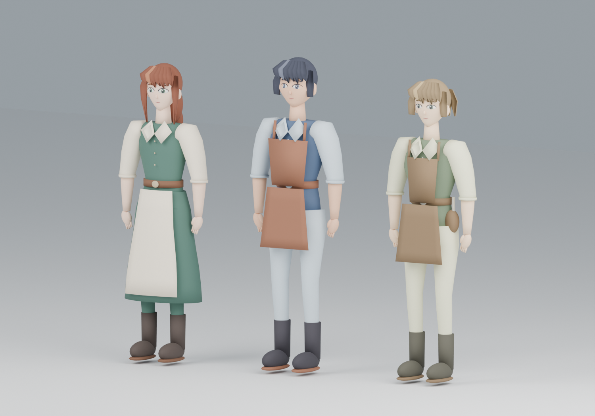
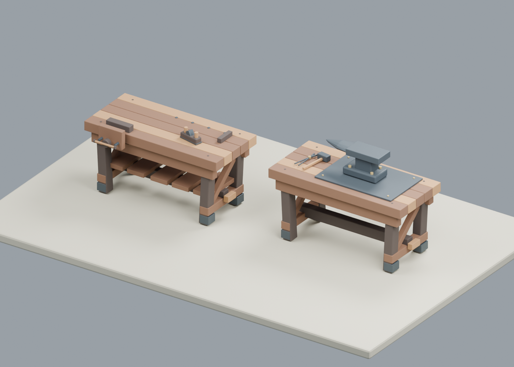
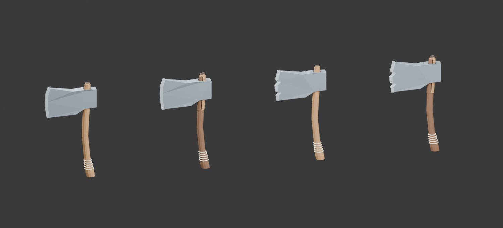

# Level0 夜间迭代交付报告

本轮把三名居民的观察、交流、行走和修理流程接到同一个持久世界中，完成第一笔由 Kimi 居民选择并实际结算的修刃交易；同时制作并接入了人物 V2、工作台、炉具、店招及可按损坏状态组合的斧头。当前交付仍是一段可验证的生活样板街，距离整座城市自主生产、扩建和丰富社会关系还有明显差距。

本轮记录窗口：北京时间 2026-09-08 22:49 至 2026-09-09 09:00。期间包含建模、构建、副本检查和正式运行，不表示游戏连续模拟了相同长度的时间。交付分支：`codex/organic-village-20260907`。当前方向是 SAO 第一层 / Level0；旧国王征税世界保留为历史，本轮没有重新接入。

## 实际发生了什么

世界 ID 为 `F4390752-4A07-7DE7-FACD-32BAC6F72C54`，保持原有 13 位居民身份与故事，艾琳、拓真、柏木 3 人活跃，其余 10 人没有激活。没有为了促成交易重新生成居民、重置钱物或清除不合作的选择。

1. 拓真询问修理需求，艾琳表达修刃需要；随后拓真报出 5 Col 的价格。
2. 艾琳选择委托，拓真接受，合同预留 5 Col。
3. 艾琳选择送斧。途中在铁匠铺门边被碰撞阻挡，修复通行路线后，继续执行她原来的送货意图，没有重新替她作决定。
4. 拓真实际消耗 1 份铁料，将斧刃从 20 修到 100。
5. 艾琳取回斧子并支付 5 Col，合同完成，预留归零。
6. 柏木提出修柄帮助，艾琳表示暂时不修。因此斧柄保持 20，没有强迫她补完另一笔交易。

| 最终状态 | 已保存结果 |
| --- | --- |
| 艾琳 / 拓真 / 柏木余额 | 95 / 205 / 100 Col |
| 斧子所有者与保管者 | 均为艾琳 |
| 斧刃 / 斧柄状态 | 100 / 20 |
| 合同 | `repair_contract_18_0`，`collected`，预留 0 |
| 生活事件序号 | 25 |
| 最终在途 API 操作 | 13 名居民全部为空 |

证据：[交易事件与财产摘录](Validation/Two_Hour_Iteration_2026-09-08/NativeRepairTransaction/transaction_excerpt.json)。NPC 说要送木料不等于木料已转移；本次实际消耗的是铁料，额外木料承诺和点炉没有执行。

## 美术交付

本轮新增 3 套既有居民外观、6 段动画，以及四套资产包合计 16 个网格导出项。16 项中包含复用部件组成的整体，不能把部件、整套装配和游戏库存重复计为不同物品。另更新了旅店、铁匠铺和木工作坊 3 处建筑的装配资源、配方与原生资源；既有 26 个基础城镇模块不算本轮新增。

| 类别 | 具体交付 | 接入与限制 |
| --- | --- | --- |
| 人物 V2：3 套 | 艾琳：绿裙、浅色围裙、赭色头发；拓真：蓝衣、皮围裙、深色短发；柏木：苔绿衣、工具腰包、浅棕头发 | 3 FBX、每人 Idle/Walk，共 6 段动画；每套源骨架 18 骨骼、12 个材质槽。已导入 UE、验证自然播放，并在同一正式世界载入。没有新增人物身份 |
| 工作台与工具：6 项 | 木工工作台、铁匠工作台、台钳、手刨、铁砧、铁匠手工具组 | 两套工作台已装入实际场景；其余部件可复用。外观更新不额外创建库存或生产能力 |
| 炉具：3 项 | 砖石炉体、手动风箱、组合冷炉 | 冷炉几何及场景安装已检查，仍是未点燃的静态设施；燃料、温度、冶炼未实现 |
| 店招：3 项 | 旅店床铺图案、铁匠铁砧图案、木工刨具图案 | 双面木牌与金属支架；修复法线、安装位置和穿插。属于场景配置，未声称由 NPC 制造安装 |
| 斧子组件：4 项 | 完好柄、裂损柄、锋利刃、缺口刃 | 共享装配枢轴，按同一把斧子的 edge/handle 切换；新增真实柄孔及更清楚的钢刃材质。4 种组合展示不代表新增 4 把库存斧 |
| 建筑与材质更新 | 旅店、铁匠铺、木工作坊装配，工作点、门口路径、木石金属材质 | 用途差异更明确，但整座城的错落建筑和自主扩建尚未完成 |

包含可编辑 Blender 源文件、生成脚本、FBX/GLB 导出物、UE 原生资源、清单和导入回执。材质槽支持分层配色复用；染衣、换装、衣物生产、面部表情仍未接入。

下面三张是 Blender 源模型预览，不能当成最终游戏画面或 NPC 实际看到的画面。

完整资产入口：[人物 V2](../Art/AincradCharacters/V2/README.md)、[工作台](../Art/AincradLevel0/WORKSHOP_README.md)、[炉具](../Art/AincradLevel0/FORGE_README.md)、[店招](../Art/AincradLevel0/TRADE_SIGNS_README.md)、[斧子组件](../Art/AincradLevel0/AXE_KIT_README.md)。原生画面见验收目录中的 NativeCharacters、NativeForge、NativeTradeSigns 和 NativeAxeSteelEye。

## 功能与阻断修复

| 问题 | 本轮处理 | 已确认的效果 |
| --- | --- | --- |
| NPC 在固定方向反复看空墙 | 增加实际转头、看本人工作台、查看所持工具；截图绑定本人眼位与朝向 | 普通观察有真实 Kimi 输入；专门的持物观察主要通过本地副本检查，未声称已由 Kimi 自主选择 |
| 观察产生重复收费回访 | 每次合格事件只允许一次观察回访，保留普通思考冷却和操作去重 | 保持同一世界运行，不靠重启或修改时间增加调用 |
| 人物只有猜测和等待，缺少可执行交流 | 增加询问、一次答复、求助、非约束建议及修理报价；个人上下文提供当前岗位、物品、合同和真实材料要求 | 产生真实问答、报价、拒绝和成交。报价本身不创建合同或扣钱 |
| 模型输出动作格式稍有变化就被拒绝 | 对唯一匹配当前合法选项的动作作有限归一化，提供准确的上次失败反馈 | 冲突、过期、不合法选项继续拒绝；旧失败回复不重放 |
| 工人站位与台面、交付位置不一致 | 对齐工作点与面向，精确到达交互位置 | 工人到岗和物品交付可实际发生 |
| 送货时在门框卡住 | 找到中间路点 60cm 提前转弯导致胶囊撞门的原因，先穿过门中线再转弯 | 保持碰撞，原送货意图恢复一次，正式世界完成交付 |
| 斧子状态变了但外观没及时更新 | 常规 Tick 按真实 edge/handle 更新两个组件，保留资源缺失时的回退外观 | 显示跟随物品状态，既有斧子身份不变 |
| 请求超出本地约 24KB 上下文上限 | 去除重复历史；按真实 UTF-8 字节数限制投影历史，保留当前事实与最新来信，超限则发送前拦截 | 实际失败请求离线复现为 24724 字节，去重后 17327 字节通过同一校验；世界完整历史不删除 |
| 已在本地被拒绝的请求仍标记未决 | 只对明确操作/账本匹配且只读证明账本无该记录的请求允许退休，不重发 | 原未发送操作清理成功，不清账、不缩短冷却、不重复扣费 |
| 一批结束后长时间停止接续 | 批次最长运行从 300 秒扩大至 1800 秒；主任务持续接续，定时唤醒只作中断后备；加入绝对截止与自有进程清理 | 继续至北京时间 9 点收尾，定时接续已删除 |

## 验证和费用

- 最新代码已在 UE 5.8.1 构建通过，最新上下文修复的原生测试为 30 项成功、0 失败、0 警告、0 未运行。这是该次完整测试套件结果，不能把每轮重复运行的测试相加宣传为不同测试数量。
- 路径恢复保留正式世界不变的副本验证通过，随后在正式世界完成了原送货、修理和付款。上下文修复通过实际失败请求的离线复现及 9 项副本恢复检查；截至截止时间，尚未等到下一次自然收费请求验证新上下文，没有强行提前调用。
- 一次批次 `town-20260909-003204` 在完成交易后，因本地上下文问题受控中断，原非零退出记录保留。最终批次 `town-20260909-005335` 正常退出，新增收费调用 0。
- 本轮新增已结算 Kimi 请求 **107 次，3.618313 元，约 3.62 元**。该数来自项目本地预算账本，不包含 Codex 用量，也不是服务商账单逐笔对账结论。
- 既有累计授权 100 元、分配上限 95 元保持。此前 6 笔未决预留 10.265088 元没有清空或当作本轮新费用。本轮没有使用额度 reset。
- 普通思考维持至少 30 分钟现实时间冷却；当前没有激活门卫，仅在规则中保留门卫私下思考 6 小时冷却。预算是上限，不为凑次数刷请求。
- 最后一批在北京时间 08:59:36 退出。09:00 后只归档、检查与整理交付，没有继续运行游戏或调用 Kimi。正式世界保留，游戏与网关进程退出，定时接续 `level0` 已删除。

完整证据：[夜间逐批验收](Validation/Two_Hour_Iteration_2026-09-08/README.md)、[最终截止状态](Validation/Two_Hour_Iteration_2026-09-08/final_stop.json)、[上下文修复](Validation/Two_Hour_Iteration_2026-09-08/NativeContextBudget/index.json)。历史失败截图、原始决策与回执保留；不会把本地强制测试冒充自主行为。

## 尚未完成与后续顺序

最小生活交易已经发生，但整个 S4 工具使用流程仍未验收完成。斧柄没有修好，未出现实际劈柴产出。完整手指抓握、抬手检查及劳动动画欠缺，持物仍有悬浮感；人物脸部、手部和阴影下的可读性仍需打磨，当前只是可用样板。

整座城仍有重复建筑；没有完成由居民的资源、家庭、职业和空间需求推动的自由扩建。其余 10 名居民、复杂情感与家庭、婚育、衣物生产、燃料与锻造产业链都不能算本轮已完成。旧马车、护卫和国王资产属于先前中世纪阶段，不能重复算作本次 Level0 新增成果。

下一轮建议依次完成：自然冷却后的真实请求确认上下文修复；让居民自主决定后续修理或其他需求，验证一次真实工具使用与产出；补抓握和劳动表现；把一项实际提出的场所改造走完提出、实现、安装、使用、回访，再激活更多居民和扩展街区。当前停止状态保持，本报告不启动下一轮。

## 提交范围

本报告与本轮代码、美术源文件、导出物、必要 UE 原生资源、设计规则和可移植验收证据一起交付。API 密钥、机器私有配置、完整 Saved 存档、预算数据库、缓存和构建产物不入 Git。原始证据 JSON/JSONL 保留字节与换行，便于核对已有哈希；本轮新增单文件均小于 4MB，无需新增大型文件的 LFS 规则。
