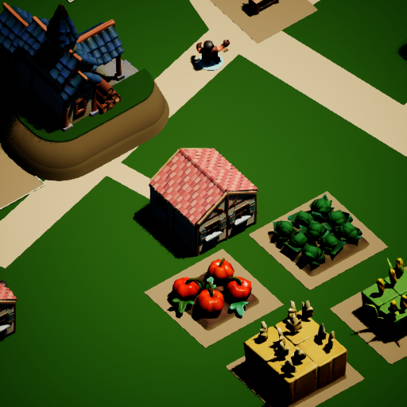

# 村民需求到美术委托：第二轮 MVP

本轮由 GPT-6 审查与集成，五名 GPT-5.6 Luna 并行实现不同模块。范围是把村民愿望接入有边界的主持人流程，并修复影响村庄持续运行的选址、交付问题。

## 五个模块

| 模块 | 游戏中的用途 |
| --- | --- |
| 村民议程 | 从真实库存、关系、税率和当前可执行动作组织决策上下文；私人愿望与事实分开 |
| 主持人需求队列 | 接收视觉反馈或明确提交的需求，去重、分类，保留提出者和稳定请求 ID |
| 自然选址 | 公共工程占地后，沿共享弯折道路寻找替代住宅位置，通过原有地形、占地和路线检查 |
| 美术任务导出 | 将纯美术提议转换为带现有目录参考、UV 与 GLB 验收要求的 Luna/Blender 委托 |
| 瓦片交付恢复 | 客户正在执行其他工作时推迟交货，保留工作、工具、工资和订单库存 |

## 实际接口与边界

`SubmitResidentWorldRequest(Index, Need)` 接收一名真实村民的请求；实景看图的选项 4 也进入同一队列。`ExportWorldRequests()` 返回 schema 1 JSON，包含世界 ID 和全部请求，供离线工具读取。存档的可选 `world_requests` 字段保留队列；旧 schema 10 存档中的个人 `DesignRequest` 在载入时迁移，已有请求 ID 不变。

主持人当前使用明确标为本地规则的保守分类，尚未另行调用主持人模型。叙事愿望只作为愿望；现有动作只返回已有能力的提示；新玩法进入规则提议；纯视觉缺口进入美术提议；模糊需求需要补充细节。分类不会支付费用、增加库存、创造人物或立即开工。

每个世界最多保留 64 项请求，每项最多 32 名提出者。相同文字按大小写和空白归一化去重，不会仅因为提到同一个名词就合并不同需求。队列满时保留个人需求，不挤掉旧项。现有动作的 `resolved_existing` 表示已给出现有能力的答复，不能当作动作完成记录。

美术导出详见 [委托工具说明](Art_Request_Workflow.md)。导出物是可审阅的任务文件，尚未自动启动 Luna、Blender 或付费建模服务。运行时代码与本文不承诺家族、骑士、皇城订单等叙事已成为玩法。

## 验收

UE 5.8.2 编译成功，42 项原生测试全部通过（5 项带引擎警告，0 失败）；美术导出工具的 5 项离线测试通过。65 秒真实 UE 运行中，10 间初始住宅完成，另外两份模块住宅的 32/32 构件已完成。6 次提案合并为 5 项需求，恰好输出 1 项纯美术委托；保存重载后，世界 ID、请求记录、计划和已有构件保持一致。

完整结果见 [验收记录](Validation/Luna_Parallel_World_Host_Acceptance.json)，具体输出见 [主持人队列](Validation/World_Host_2026-09-07/requests.json) 和 [铁匠铺招牌委托](Validation/World_Host_2026-09-07/hearth_art_jobs.md)。该委托尚未执行建模。

真实场景流程使用 `-HearthDisableApi` 和隔离世界；测试需求由脚本明确注入，用于验证接口和存档，不是 Kimi 自发提案的证据。本轮启动的两个 UE 进程及五个工作代理均已退出。交货回归验证了繁忙任务、工资预留和延后订单的存档；借出工具的保护已有代码检查，但本轮没有独立重放一个完整借工具生产任务。

本轮不改变每轮 600 次调用上限或原累计 Kimi 预算账本，不提交或推送远程仓库。
