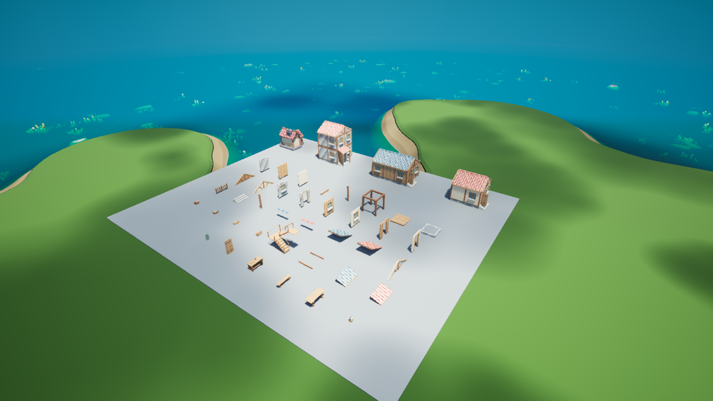

# 模块住宅与 NPC 最小施工单元

2026-09-06 用户提出美术支线：补充与当前村庄画风一致的组件，让 NPC 后续能选择住宅形状、墙材和屋瓦，并以小任务逐步建造。资产目录为 `Art/VillageKit`，建模与导出由独立美术 agent 通过本机 Blender MCP 完成。

## 单元怎样对应行为

| 层级 | 本批内容 | 对应 NPC 行为 |
| --- | --- | --- |
| 搬运物 | 木材束、木板包、石料包、瓦片箱、灰泥桶 | 领取一批材料、携带到施工点、交付一次 |
| 施工结果 | 地基、楼板、柱、梁、框架、墙段、门窗墙、屋顶片、屋脊、楼梯 | 到达施工位置；材料齐全后完成一次安装 |
| 附件与设施 | 门、百叶窗、门廊、台阶、栏杆、公共长桌、长凳、木工台 | 在有效安装点装配或制作；功能由游戏模板提供 |
| 楼层和房屋 | 单层小屋、长屋、两层石屋 | 选择一份组合方案，由多项施工结果组成 |

“搬走一层楼”不作为搬运表现。楼层是计划层级，NPC 拿的是尺寸合适的材料包；一面墙、一个框架可以作为一次施工任务的完成结果。携带模型只出现在携带阶段，交付后由库存和现场材料记录接管。

统一规格为米制、Blender +Z 向上、正面 -Y、2 米网格、层高 2.4 米。地基顶面为 Z=0，楼板位于 Z=0～0.16。普通墙板填入柱梁之间。连续房屋按网格顶点放唯一柱、按边放唯一梁；完整框架保留作独立施工原型，避免相邻框架产生重叠表面。

两层方案有实际楼梯与上层楼板开口。开口、净宽和楼梯平台的几何检查不代替 UE 碰撞、角色胶囊和导航验收。

## NPC 可以提出的设计

```json
{
  "blueprint": "cottage_terracotta",
  "wall_material": "timber",
  "roof_material": "slateblue"
}
```

`blueprint` 是布局 ID；其中的颜色词保留初始示例命名，实际墙材和屋瓦由后两个字段控制。支持 3 个布局、灰泥/木板/石墙 3 种墙材、红陶/蓝灰 2 种屋瓦，共 18 种组合。编译器会同步替换普通墙、门窗墙、山墙、坡屋顶、屋脊和门廊屋顶的同类材质变体。未知选项会被拒绝。

`Plugins/ThreeHearths/Tools/village_kit_catalog.py` 将选择编译成施工计划，使用持久地块 ID、居民 ID、设计内容生成稳定计划 ID；每件安装物和每趟材料交付有独立操作 ID。同一份输入得到同一份计划，不同地块不会共用操作 ID。

计划按楼层和结构阶段排序：地基、楼板、柱梁、楼梯、墙、山墙、屋顶、门窗附件。初版采用保守的串行依赖；并行施工以后需要现场岗位、路线和材料预留系统支持。每项安装拆出若干材料交付批次，批次总量等于模块用料，单批不超过对应携带容量。

## 与当前游戏的边界

本批交付为模型、原生 UE 资产、装配示例与离线施工数据。`catalog.json` 和 `construction-plans.json` 明确标记 `runtime_binding: pending`、`live_execution_ready: false`。当前村民仍运行原来的建房和生产逻辑，尚不会读取这些计划或真实挑选新房型。

现有库存只有食物、木材和石材；本批木板、屋瓦、灰泥是待接入的加工建材。目录中的数量是平衡草案，没有修改现有配方、库存或扣料规则，也没有把石材直接当作陶土。加工生产、材料存储和转运接入后才能执行相关任务。

下一步接入必须包含：稳定地块/居民 ID 与世界存档、合法占地与门口路线检查、安装点和施工岗位、材料预留/交付去重、中断恢复、角色携带表现，以及门、楼梯、家具的碰撞和交互模板。整房实际包围盒含屋檐、台阶和门廊，不能只按名义 4×4 或 4×6 米判断是否放得下；长屋可能需要扩大现有住宅地块。

公共长桌和长凳继续服务于 MVP 的会客点目标。住宅模块为用户新增支线，既有世界存档与协作任务的缺口仍需逐项完成。

## 数据与复现

- `Art/VillageKit/module-specs.json`：艺术规格、模块 ID、原点、接口尺寸。
- `Art/VillageKit/model-report.json`：本次模型的实际尺寸、材质及面数。
- `Art/VillageKit/example-layouts.json`：与 Blender 示例同源的逐件装配变换。
- `Art/VillageKit/catalog.json`：可选择材质、搬运与施工语义、资源接口。
- `Art/VillageKit/construction-plans.json`：三份完整离线计划示例。
- `Art/VillageKit/validation.json`：独立 GLB 检查和 18 种组合验证。
- `Art/VillageKit/UE_Import_Report.json`：原生导入、尺寸及源文件校验值。
- `Art/VillageKit/UE_Validation.json`：UE 内核对 41 个网格的源文件、材质、摆放及 38 件组件的尺寸换算。

```powershell
python Plugins/ThreeHearths/Tools/village_kit_catalog.py
python Plugins/ThreeHearths/Tools/validate_village_kit.py
```

独立检查直接读取最终 GLB，检查结构、UV、单位法线、退化三角形、面数预算、屋瓦粗糙度和弧面法线；施工数据检查材料批次守恒、操作 ID、依赖顺序及非法选择。它不调用真实模型服务。

原生资产导入脚本 `import_village_kit.py` 在 UE 编辑器命令行工作进程中运行。初次导入保存新目录；同源校验值一致时可跳过。重建本批自有资产后，显式加 `-VillageKitReplaceChanged` 才会重导已有记录中的变化源；未记录的已有目录仍要求检查。

`create_village_kit_showcase.py` 创建独立 `L_VillageKit_Showcase` 美术查看地图，沿用原村庄岛屿与灯光，展示组件、组合房屋及 Cropout 原房屋参照。该地图为静态美术查看用途，不启用 NPC 建造和导航。

在 Content Browser 打开 `/Game/ThreeHearths/Maps/L_VillageKit_Showcase` 即可查看。`VillageKit/Modules` 文件夹有 38 件独立组件，`VillageKit/Examples` 有 3 栋组合房屋；原生网格位于 `/Game/ThreeHearths/Generated/VillageKit`。展示地图有统一地台，避免岛屿海岸线穿过展示物。重建已有展示需显式加 `-VillageKitRebuildShowcase`，只替换本工具标记的展示物。

UE Python 的 `Rotator` 构造函数使用具名 `pitch/yaw/roll` 参数；本机实测位置参数第二项对应 pitch，误用会让物件横倒。原生检查会验证实际摆放保持直立。

本批已在 Blender 5.2.0 LTS 与 UE 5.8.1 实际检查。38 件组件共 55,656 个三角形，单件最高 4,860；18 种离线设计均通过材料批次与依赖检查，三份示例分别有 55、72、97 次安装。完整记录见 [验证记录](Validation.md)。


