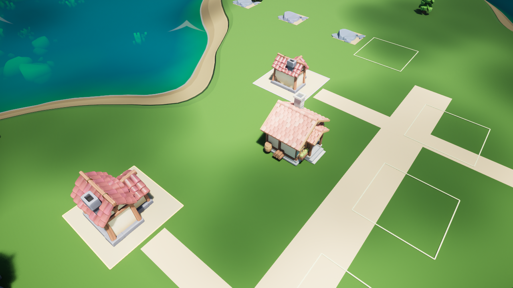

# MVP 第 1 步：PIE 本地 GLB 导入预览

2026-09-06 完成第 1 步的本机验收。基线为仓库 `4a4fc4f`，本次实际引擎为 Windows **UE 5.8.1-56057345**；原项目资源在 5.8.2 制作。本次编译、12 项 Python 离线测试、5 项 UE 原生测试和 11 项 PIE 验收均通过。



画面中央为此次导入的原创小屋：屋瓦、木梁、门阶、桶和柴堆材质可见，朝向、尺寸和落地位置与原小屋一致。机器可读结果见 [验收记录](Validation/PIE_Import_Acceptance.json)。

## 实现与边界

`Plugins/ThreeHearths/Tools/pie_import_preview.py` 是手动编辑器 Python 入口。在已经运行的本地规则村庄 PIE 中执行 `preview.start()`，保留原小屋作为等待和失败时的外观。

本机 5.8.1 的直接 PIE Interchange 导入实测出现 `Bad MeshDescription`、零 LOD 和零尺寸。当前实现启动一个隐藏的 `UnrealEditor-Cmd.exe` 子进程，在编辑器资产构建路径中导入；主编辑器每帧检查结果，不同步等待子进程。无需修改引擎源码。导入参数显式合并网格、烘焙节点变换、保留材质，关闭骨骼、动画和新碰撞。

工作进程把资产保存到独立的 `Content/Developers/ThreeHearthsImportPreview/<id>` 缓存，再原子写入结果清单。主编辑器确认子进程成功退出后读取资产，检查一个合并网格、完整的 19 个材质槽及与原小屋一致的尺寸。C++ 的 `HearthImportPreviewLibrary` 仅允许在 PIE 世界中生成临时模型，保留原小屋碰撞，成功后才隐藏原外观。

缺失或损坏文件、导入失败、超时都会保留或恢复原小屋。停止、村庄重开和退出 PIE 会终止本工具创建的工作进程，销毁临时外观；迟到结果不能影响新的一轮。退出 PIE 后原生对象已销毁但 Python 包装仍存在的情况也已覆盖。同时只允许一个工作进程，在它退出并完成清理后才能重试。

缓存、报告和工作进程日志均被 Git 忽略。工具会保存临时资产包，不保存地图或覆盖正式资产；缓存保留以供排查，目前不自动清除。报告位于 `Saved/ThreeHearths/import-preview/<id>.json`，对应子目录含请求、结果和日志。

此工具仅验收已知共享 UV 小屋，仍依赖 Windows UE 编辑器、Python、Interchange 和一次额外编辑器进程。它不是任意外部模型导入器，也不是打包程序的运行时导入；没有调用模型生成服务、接入 NPC 入住或设施生产。

## 本次验收

源 GLB 为 1,200,576 字节、45 个源网格、19 个材质，SHA-256 为 `9150a48c955c66dada6e1e3f2706ab92ae5d2e53a774be1ff65b71a5a3430a91`，与原资源报告一致。

| 检查 | 结果 |
| --- | --- |
| C++ 编辑器目标编译 | 通过；使用本机 UE 5.8.1 和 VS 2022 |
| Python 生命周期及文件检查 | 12 项通过，含迟到结果、超时、清理失败及失效 UObject 包装 |
| UE 原生自动化 | 5 项通过：独立请求名额、模型输出、预览世界隔离、两项移动测试 |
| PIE 成功导入 | 6.687 秒；等待期间 200 次 Slate tick，最大间隔 47 毫秒；模拟推进 6.650 秒 |
| 新 PIE 再次导入 | 6.812 秒；204 次 Slate tick，最大间隔 47 毫秒；模拟推进 6.950 秒 |
| 成功后停止 | 原外观恢复，临时模型销毁 |
| 缺失、截断、无几何数据 GLB | 三种情况均回退至原外观 |
| 超时、重复请求和取消 | 拒绝重复请求，工作进程退出，保留原外观 |
| 村庄重开、退出 PIE、编辑器世界误调用 | 旧模型和进程清理，编辑器世界拒绝预览 |
| 材质、尺寸、摆放、交互观察 | 材质及落地画面通过；村民继续活动，点击米拉可切换面板并打开历史 |

11 项 PIE 验收均通过，每个导入/清理案例记录的剩余工作进程数为 0。采用独立 `enabled:false` 配置及测试历史，成功路径断言模型 API 请求数为 0。移除了已废弃的 `r.Mobile.VirtualTextures` 配置项，它原先导致本机命令行编辑器产生 handled ensure 并以失败状态退出。

帧间隔是等待期间的 Slate 采样，不能当成完整的帧耗时分析或所有硬件上的性能保证；小模型成功不代表大型模型也能保持同等响应。原生隔离测试在销毁无引擎上下文的临时世界中 Actor 时记录了一条 `World has no context` 警告，测试结果为通过；真实 PIE 的退出和重开另由上述验收覆盖。

## 复现

先编译工程。本机示例：

```powershell
cd D:\Dev\vibeGamingDemo1\ThreeHearthsVillage
.\Build-Village.ps1 -EngineRoot D:\UE_5.8
python -m unittest discover -s Plugins/ThreeHearths/Tools -p test_pie_import_preview.py -v
```

用独立且关闭模型的配置启动验证实例，避免写入个人角色历史。只在没有该项目编辑器实例时启动：

```powershell
$projectRoot = 'D:\Dev\vibeGamingDemo1\ThreeHearthsVillage'
$validationDir = Join-Path $projectRoot 'Saved\ThreeHearths\import-preview'
New-Item -ItemType Directory -Force -Path $validationDir | Out-Null
$configPath = Join-Path $validationDir 'offline.json'
'{"enabled":false,"autonomous_life":true}' | Set-Content -LiteralPath $configPath -Encoding utf8
$historyPath = Join-Path $validationDir 'history.json'
$editorArgs = '"{0}\CropoutSampleProject.uproject" /Game/ThreeHearths/Maps/L_ThreeHearthsVillage -HearthApiConfig="{1}" -HearthHistory="{2}" -ExecCmds="t.MaxFPS 30"' -f $projectRoot,$configPath,$historyPath
Start-Process -FilePath 'D:\UE_5.8\Engine\Binaries\Win64\UnrealEditor.exe' -ArgumentList $editorArgs -WindowStyle Normal -PassThru
```

开始村庄 PIE。在 Output Log 的 Python 输入模式执行：

```python
import sys, unreal
from pathlib import Path
tools_dir = str(Path(unreal.Paths.project_dir()).resolve() / "Plugins/ThreeHearths/Tools")
if tools_dir not in sys.path: sys.path.insert(0, tools_dir)
import pie_import_preview as preview
session = preview.start()
```

等待导入期间可操作镜头和村民面板。检查北侧原小屋位置及材质后，可分别执行：

```python
preview.stop()  # 恢复原小屋；工作进程退出后才能再导入
preview.start(source=str(Path(unreal.Paths.project_saved_dir()) / "missing-preview.glb"))
```

运行完整验收时，使用新模块会话、正在运行的离线 PIE、且没有工作进程在收尾。验收脚本会重开村庄、退出和重新进入 PIE，最后保留成功外观供观察：

```python
import validate_pie_import_preview as validation
validation.run()
```

查看 `Saved/ThreeHearths/import-preview/acceptance.json` 的最终 `status`。原生测试在 Output Log 的 Console 输入模式执行 `Automation RunTests ThreeHearths`。第 1 步验收完成；下一轮范围为稳定对象 ID 与静止世界存档。
