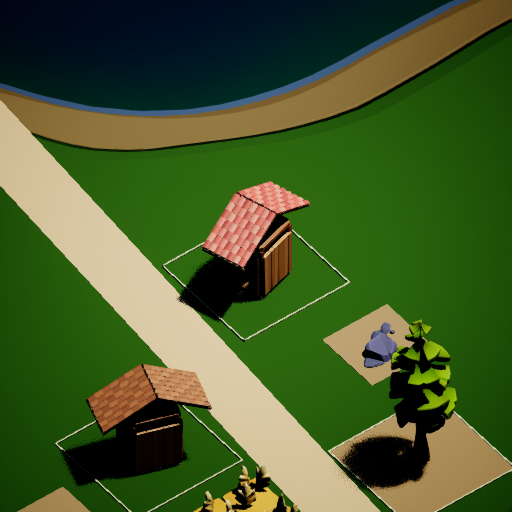

# 村民看图与院落建造：第一轮 MVP

本轮实现的是“持久目标 → 实景观察 → 有限设计意向 → 材料与空间校验 → 逐件施工 → 完工复查”。村民可以向 Kimi K2.6 发送自己住所的真实 UE 图片；模型只决定已有能力范围内的改进意向。愿望不会直接变成资产、库存、人物或已完成工程。

## 已接入游戏的行为

- 每名村民分别保存生活目标、上次看图反馈、扩建方向和一项待主持人处理的需求。职业和个人偏好影响初始目标；国王保留征税与追求排场的背景。家人、骑士和皇城订单仍明确标为未实现的愿望。
- 新世界使用共享的弯折街道数据来绘制道路并选择住宅位置，加入可复现的退距和朝向差异。旧存档继续使用自己的布局版本及建筑坐标。
- 原来只能沿一条轴追加房间；现在可向左、右、后方添加独立屋顶和入口的院落房间。侧向房间中心相距 4 米；后方为 6 米，避开实际长达 4.5 米的屋顶投影。它们是由室外通道连接的院落单元，尚不支持连体 L/T 形复杂屋顶。
- 新房间仍消耗现有目录构件、木板、梁、石料或瓦片，以及真实工资。原有构件 ID、位置、材质和支付状态保留。检查真实屋顶占地、地形、邻居、道路与已有工作入口；新的房间也进入村民避障计算。
- 自动规划遇到障碍会尝试其他方向；模型指定的方向必须通过相同规则才能动工。工匠已认领的住宅用地会保留到材料和积蓄就绪，避免提前被种树占用。
- `SetResidentDesignGoal(Index, Goal)` 可修改目标并解除“满意后暂停扩建”的状态。村民面板显示目标、视觉反馈和待处理需求；完整信息进入世界存档和历史。

## 看图时的约束

使用游戏内 SceneCapture，不截取桌面。发送一张 512×512、最多 512 KiB 的 PNG，以及该村民的目标、性格、库存和自有建筑信息。拒绝空白图片；不同观察保留独立文件。网络请求复用每名村民现有的独立槽位，不另开一套付费通道。

只在住所完成或目标改变后触发；每名村民至少间隔 120 秒真实时间，全村截图至少间隔 3 秒。生活、社交和看图共用每轮最多 600 次请求的上限，也共用已有累计人民币预算。

看图期间继续本地吃饭、休息、搬运和生产，暂缓启动下一项住宅计划。回应到达时复核观察对应的目标及施工状态；过期回应只留档。HTTP 超时或账单不确定沿用原预算网关的处理，不自动重试付费请求。

输出选项为：满意、向右扩建、向左扩建、向后扩建、提交一项待审需求。提交需求只进入该村民的持久记录，尚未自动交给 Luna、Blender 或代码生成代理执行。这是后续主持人审核与资产生产流程的入口。

## 费用与验证边界

本机配置为 `kimi-k2.6`，已通过官方余额接口验证凭据可用。查询时可用余额为 ¥156.20364，其中现金 ¥150、赠送余额 ¥6.20364；这不是项目的累计花费。

实际 UE 截图与样例提示词已发送到官方 token 估算接口。按项目已有费率（未缓存输入 ¥6.5/百万 tokens、输出 ¥27/百万 tokens）及最多输出 256 tokens 计算，样例单次约 ¥0.010，600 次约 ¥6.03。正式请求包含更多村民状态，费用会不同；详见 [输入估算记录](Validation/Kimi_Vision_Estimate.json)。

本轮未发送付费 Chat Completions，没有初始化或重置累计预算账本。旧机器的凭据可用，但家里的累计账本没有随代码同步；官方余额不能替代未决请求和累计支出的记录。要启用本项目的实付点评，仍需恢复原 `Saved/ThreeHearths/Budget` 及正常网关配置。

## 验证与复现

已有预算测试 14 项、新增图片传输测试 4 项，覆盖真实本地 HTTP 的图片内容、账单回执、幂等请求、损坏图片和尺寸限制。所有账本和上游均为隔离测试数据。

新增原生测试覆盖三个方向的真实构件组装、旧构件不变、材料不足回滚、反馈保存、过期反馈、看图期间饥饿村民继续生活，以及弯折街道的空间和连通性。最终 38 项原生测试全部通过（其中 5 项带引擎警告），结果另见 [验收记录](Validation/Resident_Visual_Building_Acceptance.json)。

真实 UE 隔离运行采用 `-HearthDisableApi`。100 秒运行中出现三份模块住宅计划，每份 16 个构件，并抓取了木匠、国王和陶工视角。截图包含真实的未完工状态，不表示全部屋顶已完成；这次自然运行没有验证多房间院落已全部自动建成。多方向院落的材料施工与保留旧构件由原生测试验证。

最终版本另用全新隔离世界复验：10 间初始住宅均已完成，出现两份模块住宅计划，四次截图均有效；验证进程已退出。

[场景与图片清单](Validation/Design_Observation_2026-09-07/runtime-summary.json)

构建：`Build-Village.ps1 -EngineRoot <UE目录>`。

离线网关验证：运行 `Plugins/ThreeHearths/Tools/test_kimi_budget.py` 和 `test_kimi_vision.py`。UE 原生自动化筛选 `ThreeHearths`，隔离运行时使用 `-HearthDisableApi -HearthNoWorldPersistence`。

[Kimi 官方视觉输入说明](https://platform.kimi.com/docs/guide/use-kimi-vision-model) · [官方 token 估算接口](https://platform.kimi.com/docs/api/estimate)
