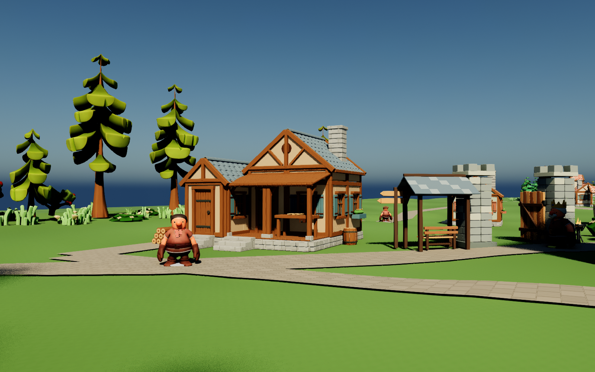
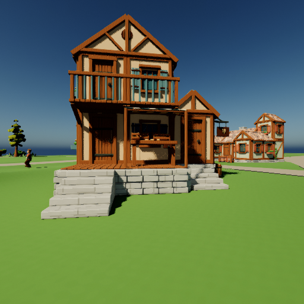

# 起始之城第一版：实际运行与验收

2026-09-08。继续 `MedievalShowcase` 的原世界，没有重新播种或替换居民。美术方向、资料出处、布局及资产规则见 [设计约定](../../Design/Aincrad_First_Floor_Art_Charter.md)。

## 本轮实际成果

- 第一层参考拓扑已落实为用途规划、道路和自然景观：生活起点、林缘生产、田野、东侧草甸以及北方扩展预留。保留原有产权和住址；中央高地主堡与上山路仍是本世界的独立目标。
- UE 原生母材质及 11 个实例已经生成并实际渲染。暖灰泥、灰石、陶瓦、板岩和木构统一色彩与粗糙度；石墙/道路采用世界尺度纹理，瓦片与木构保留原 UV。建筑阴影增加少量环境色，玻璃与未识别材质保持原样。
- 天然植被按 10 片疏密不同的林地分布，实际放置 200 株树、401 株下层植物，使用 8 种既有资产。道路、宅地及皇家工程预留范围经过避让；没有产生免费可采库存。
- 居民会从生活流程进入一次有时限的实地查看，沿实际路线到自家前沿、转向目标，再用眼部位置和实际朝向的 85° FOV 图片请求 Kimi。记忆、归属与图片证据分开；到达一个目标的记忆不能用于识别另一个目标。
- 每次发送的 PNG 都有唯一编号，并保留世界、人物、时刻、眼部位置、朝向、FOV 和来源元数据。需求绑定实际图片；协调者鸟瞰图不作为居民视觉输入。

## 原生 UE 画面

以下是游戏中真实构件的协调者展示镜头，未做像素调色或 AI 重绘，并非 NPC FOV。

[查看木匠住宅的逆光面](home-0.png) · [已建场景全景](town.png) · [用途及城堡待建轮廓](planning-map.png)

城堡图中的金色线框仅是规划。实际仍为 **27 / 1276 构件**，需要现有材料、运输和工钱。300×300 米地图与 13 名居民还很稀疏，不能把这版称作已经完成的 SAO 城市。

## 真实 Kimi 反馈

本轮六批共 **30 次真实调用，新增 0.458671 元**。本机既有账本累计 91 次、1.5639156 元，未决预留为 0；旧远端未核清责任 17.3692551 元仍另外保守预留，没有重建或抹掉旧账。详见 [汇总证据](summary.json)。

前面的批次先暴露了全景信息混入、逆光过暗、归属记忆被误当成视觉证据不足等问题；本轮分别修正了个人上下文、材质环境色和亲历识别规则。以下是最终 `personal_inspection_v3` 批次，四次接口调用均有真实 usage，但并非四个意图都被游戏接受：

| 居民 | Kimi 的实际意图 | 游戏处理 |
| --- | --- | --- |
| 伊芙，商人 | 临街立面符合经营需要，先暂停扩建；后方货仓仍未知 | 接受 0，记录满意和暂停扩建 |
| 米拉，农民 | 门前种两棵果树并留花带，提供遮阴、方便辨认入口 | 原文缺少“未知”字段，拒绝执行；未创建已批准种植任务 |
| 托马斯，采集者 | 外观已有自然层次，想保留院落 | 原文缺少“未知”字段，拒绝执行 |
| 罗莎，陶工 | 阴影中的外观难以评估，待改善观察条件再看 | 接受 6，保留原有设计状态 |

罗莎还把白天逆光误读成“月光”，这是模型误判，不能写成世界天气事实。看图回答仍需核验，不能因为接口成功就当作需求已获准或功能已经完成。

商人实际收到的个人 FOV 原图：

[最终批次原始结果与图片元数据](aincrad-memory-final/verification.json) · [材质复核批次](aincrad-material-final/verification.json) · [有真实步行的查看批次](aincrad-final/verification.json)

## 验证范围

最终 C++ 编译通过。原生自动化完整运行 116 项，初次有 2 项失败：巡逻点被新布局挡住、双家具测试夹具选了只有一处合法摆放空间的宅地。前者改为在有界范围内寻找可走的巡逻点，后者选择确实容纳两件家具的测试宅地，未放宽实际摆放约束。两项分别复测通过；最终再跑设计与视觉相关 8 项，全通过。[每项最终测试结果](automation-results.json) 记录完整运行和后续复测，保留原来 7 项警告，不冒充一次全绿的完整运行。

每批运行都比较前后存档：同一个世界 ID、13 名居民的稳定身份及长期故事、原有宅地坐标和城堡 ID 保留，世界时间继续推进。另做一次关闭 API 的冷启动续跑；这项只证明存档恢复，不单独证明带网络请求重试时的幂等性。[冷启动记录](aincrad-cold-restart/verification.json)

材质资源保存成功，运行中未发现材质编译错误；实际 PNG 已检查，建筑逆光面较上一版可读。树木背光仍偏黑，人物仍是旧版玩偶比例，屋檐、山体轮廓、地面边缘和街区密度仍需要专门美术迭代。

## 后续实现顺序

1. 先把视觉输出改成明确的结构字段，对缺失字段进行有界修复，保留拒绝结果。解决“有价值的种植需求因格式不合格丢在执行门外”，不把未验证内容直接升为世界事实。
2. 做一个种植实例闭环：以米拉的未批准提议为参考，重新形成合法请求，核对她的资金、宅地、通行和植物养护成本，再批准、付费、种植、使用与复核。同一套能力可供国王和其他居民使用。
3. 在同一条街完善屋檐厚度、门窗比例、日光与树叶阴影、墙边植物及生活物件，然后作为后续模型验收样板。建筑变化由用途与需求驱动。
4. 继续城堡材料供应和真实施工，再逐步增加街区密度。主持人暂停世界、实现新能力、迁移原存档、检查实际使用的总闭环还未全自动。

本轮变更保留在本地工作区，未提交或推送 Git。
