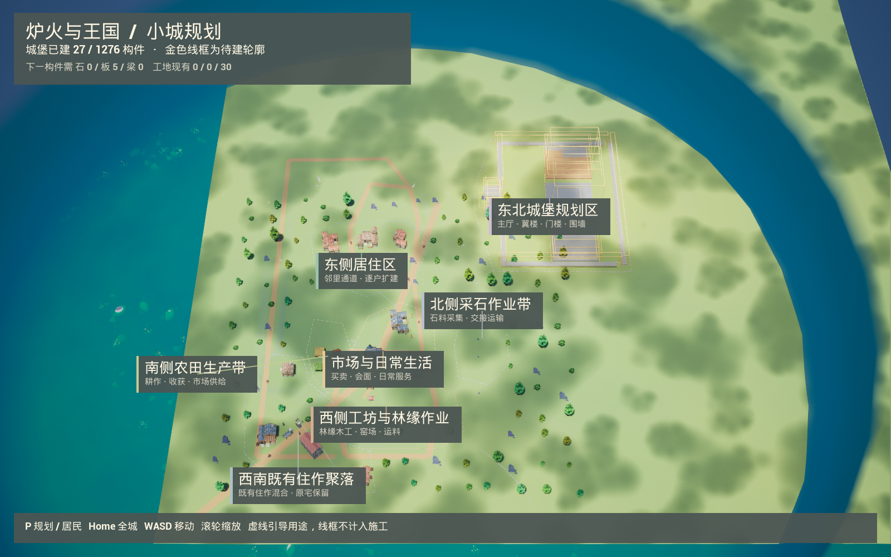

# 城堡续建与小城分区 · 2026-09-08

本轮落实用户指定的小城用途规划，并修复城堡木板供应闭环。Luna负责采购、生产、施工和分区数据；Astra负责场景轮廓、相机、界面、集成与真实验收。没有把规划线框当作已建建筑，没有重置世界或注入钱、材料。

## 为什么原来一直停在25件

同一存档下一件 `east_wing_floor_tile_03_00` 需要5木板，工地只有1木板。共享库存虽有115木板，采购只接受居民真实拥有的私人份额；十名普通居民的私人木板均为0。原生产评分同时追逐整个1276件城堡的远期需求，且把共享木板算成可采购库存，掩盖缺口。税款保护又挡住了必要的锯木工资。

现在按当前阶段接下来最多三件构件计算缺口，分别核对工地、预留、已交付、当前工人携带及采购在途材料。优先加工欠缺的私人锯木份额，按实际任务逐次预留工资和采购款，保留安装工资。共享木板仍是共享财产；锯木、搬运、出售、纳税、安装均沿用现有状态机与账本。测试还修复了小地图采购仓库与生产仓库坐标不一致的问题。

视觉上，阶段2要求83块地板全部完成后才进入立墙阶段；本轮前只有15块地板完成。这个顺序和1276件原配方保持不变，因此短时运行不会凭空出现一座完工城堡。

## 规划落地

| 区域 | 用途与依据 |
|---|---|
| 东北城堡 | 主厅、双翼、南门楼、围墙；按实际城堡构件方案聚合轮廓 |
| 东侧居住 | 现有四户住宅、邻里通道、逐户扩建 |
| 中央市场生活 | 买卖、会面、日常服务 |
| 西侧工坊与林缘 | 连接现有公共木工、窑场和西树林，保留运料空间 |
| 西南住作聚落 | 保留已有石匠、国王、陶工、铁匠的住作关系 |
| 南侧农田 | 既有农田、收获与市场供给 |
| 北侧采石 | 既有石料点、采集及交接运输 |

边界是不规则用途引导，不是新地块或围栏。分区对organic建房选址增加最多8分软偏好，产权、路通、空间和费用硬校验仍生效；既有住宅不搬迁。城堡约67×60.5米、最高31.809米的规划外包轮廓来自实际模块尺寸，约243条线段，包含主体、屋顶分湾、门楼和围墙。独立无碰撞实例组件不记入施工或产权。

默认显示规划，`P`切换居民界面，`Home`显示包括城堡的全城，WASD和滚轮继续可用。镜头按完整三维范围和窗口比例取景；标签按真实字体宽度排布并避让，连线对应实际区域。已有 `M_VillageTint` 仅补实例渲染使用标记，修复轮廓错误使用默认黑色材质；重建脚本为 `Tools/configure_town_planning_material.py`。

## 真实运行和Kimi

- 世界 `81BDF793-42B4-FAFB-4A27-A983C0C3BF6C`，13人，续用 `Saved/ThreeHearths/MedievalShowcase/world.json`。
- 首轮180秒、请求15倍模拟速度：城堡25→27，新增两块原有待建地板，完成9张真实私人木板采购单。
- 冷启动70秒、3倍：27件保留。世界ID、住宅位置、构件ID/配方/阶段/偏移、人物ID和内在故事均核对保持。最终画面另作70秒、1倍、不付费的展示验收，最终状态见附带JSON。
- 本轮真实付费13次：12次游戏内请求，以及1次协调者触发的国王城堡图片复核；新增费用0.2846744元。现有本机账本52笔已结算、0未决；累计0.9089376元。保留远程旧账摘要负债后，保守总占用18.2781927元，未重建或重置旧账本。
- 游戏内Kimi实际促成国王与护卫、石匠与陶工、铁匠与门卫的交谈，以及居民购餐；国王另有原生城堡看图请求，提出一条弧形碎石步道，状态为设计意向，尚未安装。
- 国王个人图片隐藏规划组件，只拍自己委托的城堡；所有请求继续携带持久内在故事，并收到同份用途规划说明。协调者额外看图的“连片地板、预留种植带”是反馈，不能冒充自动执行。模型提出的“三格种植带”不是已存在的计量/地块规则，未据此创建空间；对未见结构的猜测也未转成事实。

本轮末仍需持续税收、原木和劳动供给。第一轮结束税款仅1币，冷启动后的真实日常消费让余额回到7币；不能据此宣称整座城堡已资金充足。林带生态、明显高差、绕山道路和大规模人口扩展也尚未在本轮完成。

## 验证

UE5.8.2编译通过。全套108项通过（102无警告、6带既有警告）；测试覆盖分区边界和地标、城堡真实尺寸与位置变换、私人/共享/在途材料区别、受保护工资、完整生产采购施工及结算幂等。首次失败的小地图仓库问题已修复并通过复测；最终界面字体与材质调整另外以真实UE截图验证。

可核对摘要：[verification.json](Castle_Town_Plan_2026-09-08/verification.json)。详细私有运行日志在仓库根 `.codex-ue58-diagnostics/castle-plan-20260908`；预算数据库、私有配置和Saved存档不复制进交付文件。没有提交或推送，本轮启动的游戏、网关和代理均在验收后清理。
