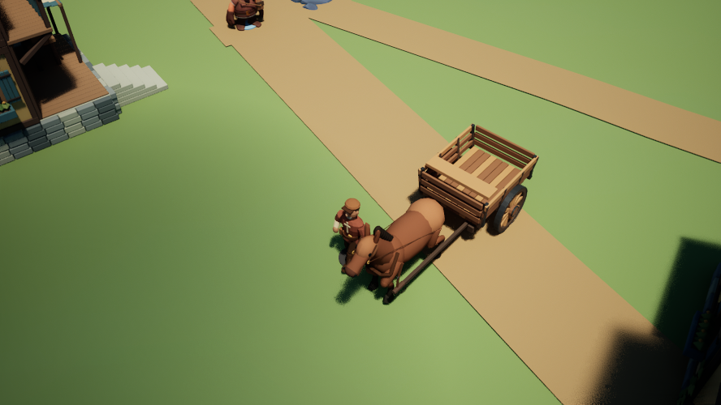

# 马车从房角退让并完成原运单

2026-09-08，本机 UE 5.8.2，在拉取 `fb5f3b9` 后继续原13人世界。Luna负责导航、货运执行和恢复测试；主代理复核、修复测试夹具、处理倒车动画并进行编译、真实运行与Kimi验证。本轮没有提交或推送。

## 实际结果

原世界 `81BDF793-42B4-FAFB-4A27-A983C0C3BF6C` 的第二单 `ED104C19-402A-2AC0-0135-71A2882623D9` 已完成。原先装在车上的6根房梁进入公共工程，工程房梁库存从6变成12；同一工资预留只结算一次，车夫获得3币。随后他正常购买食物并接下第三单，空车回仓。没有取消重建第二单、重新扣料、传送车辆或修改检查点中的货物。

| 状态 | 第二单 | 车辆累计里程 | 工资 |
|---|---|---:|---|
| 修复前 | 装着6根梁，卡在房角 | 15307.120 cm | 原预留3币，未支付 |
| 修复后 | 原单完成卸货 | 18706.262 cm | 支付一次 |
| 冷启动后 | 完整保留已完成状态 | 18706.262 cm | 同一交易，无重复支付 |

第一单的全部存档字段保持一致。米拉的两张长凳 `request_2`、`request_11` 的构件、位置、费用和施工记录也逐字段保持一致。世界校验和一致，并通过原生加载及材料/资金守恒校验。

图中是第三单回仓途中的空车；不能将这张静态图单独当作第二单交付证明。交付证据是同一订单、库存、工资交易和原生运行日志。

## 原因与代码

旧存档的车头已与住宅转角的现行障碍范围重叠。原规划器只向前搜索，并在起点碰撞时立即拒绝，所以反复等待也没有出口。

普通前进规划保持原契约。新增恢复路径固定车头，以20 cm/s倒车，最多退9米，每10厘米验证一次，并且先找到可连接的前进路线才提交。每个初始障碍的完整扫掠重叠都不能扩大，总重叠必须减少；不能因此进入另一堵墙。地形、坡度和行人始终有否决权。最多6次有界前进连接搜索，失败保留货物等待。

倒车路线及车头角度沿用现有持久化字段，冷启动可继续倒车。里程始终累加正数，轮子及行走动画另根据真实位移方向倒转；停车不会空转。视觉相位在重新创建表现对象时重新建立，不保证车轮精确相位跨重启一致。

## 验证

- UE Development 编译成功，原先未初始化 `Source` 的编译警告已修复。
- 专项10/10通过，包括薄后墙、初始重叠加深、斜向退出、有限搜索、缺地面、行人等待、多步倒退、全新世界恢复、原单卸货和重复结算防护。
- 全套104/104通过：98项无警告，6项带已有警告，0失败、0未执行。并非“只有进程退出码为0”：已检查UE导出的完整测试报告。
- 图形模式真实运行：复现90秒；货物层审计40秒；原生Kimi180秒；修复后120秒；冷启动40秒。运行沿用同一份存档，没有重置世界。
- 本机演示入口又实际运行30秒并正常保存退出。启动脚本现在自动查找C盘/D盘的UE5.8，也仍支持显式 `-EngineExe`。
- 6根房梁的12层原生部件均已创建并开启显示，位置边界也已审计；没有发现组件未加载的问题。这不能单独证明每根梁在画面中都清晰可辨，梁与车底颜色接近，装载辨识度仍可改善。

本机诊断：`C:\vibeGamingDemo1\.codex-ue58-diagnostics\freight-recovery-20260908`。检查点源文件仍保留修复前状态，供恢复回归测试使用。本机已验证进度保存在 `Saved/ThreeHearths/MedievalShowcase/world.json`，正常运行入口 `Launch_MedievalSociety.ps1` 会继续该存档。Git不包含Saved；另一台机器加载原检查点时会自行执行恢复。

## 真实 Kimi 反馈

用户获知旧主账本未同步后明确授权“直接用kimi”。继续使用现有城市验证账本，未重新初始化。8次原生请求结算0.1659045元，1次车夫实景复核结算0.016274元，合计9次、0.1821785元，无新增未决。

- 铁匠选择加工房梁，实际送回2根并领取3币；陶工想和伯恩聊陶坯阴干台，提议被婉拒；织工找罗兰聊天；采集者购买食物。
- 国王想找罗兰谈建设，商人想找陶工联络。两次回复到达时目标已不可用，执行层正确拒绝，改走本地规则。原始付费回复仍在私有账本；当前游戏失败记录会覆盖原来的意图，后续应保留它以便居民另约时间。
- 用马丁自己的持久故事和真实空车画面复核。PNG只做无损传输重压缩，尺寸与解码后每个像素完全一致。Kimi提出回仓清点第三单6根房梁，但也将远处物体误认成另一辆载货马车，并由静态图推断它在行驶。
- 这次额外看图是协调者验收反馈，**没有伪装成游戏中已执行的自主行为，也没有直接生成施工请求**。未把误识别写入世界事实。应明确区分三张运单与一辆实际马车、工资预留与支付，并以账本及实体核对视觉判断。

## 下一批应解决的实际瓶颈

城堡仍为25/1276个构件。本次冷启动末，工地库存是石材0、木板1、房梁12；下一个未完成地面构件需要5木板。全村石材14、木板115、房梁621。这里暴露的是材料调度失衡：当前货车持续运梁，但眼前施工缺木板。后续应让居民/国王看见当前阶段缺口，让同一套运单按真实施工需求运料、预留和结算，再用Kimi与真实施工复核是否增加构件；不能用继续堆梁或新增模型数量代替建设进展。

更正：初版报告与对话将公共工程数组的石材、木板次序读反，把缺5木板写成缺5石材。代码 `HearthPublicWorks.cpp` 的 `HeldPlanks=PublicProject.Stock[1]` 与 `HearthRoyalWorksPlan.cpp` 的材料顺序均确认索引1是木板。本次更正不修改存档、库存或已验证的6根房梁交付结果。

本轮恢复了货运的一条中断流程，尚未完成整座中世纪城市的长期目标。没有重启此前结束的定时任务或后台持续付费运行。
