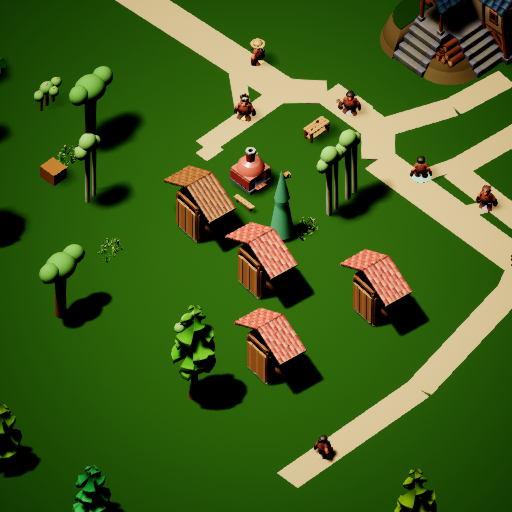
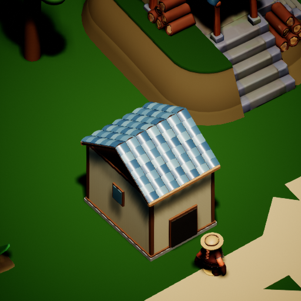

# 真实 Kimi 通用物件需求验证

2026-09-07。测试使用旧样板的独立副本，为木匠和农民分别设置了木桶、地窖测试目标；长期角色故事保持原样。以下提案来自两次真实 Kimi 看图回复，尚未执行建模或施工。

本次实际 usage 计费 0.027589 元，账本累计 0.270312 元、22 次已结算，未重置预算。

## 林恩

请求：`request_6`。目标房产：`resident_9EA7C059-42A4-724D-064A-9A8D25D61CF5_house_courtyard_workshop`。

看见：院落东南角有片裸露泥地，靠近道路与树林，适合放置物件；未知：该处是否已有地下排水或管线经过；打算：求一只以复用旧梁箍成的矮木桶，口径约两臂，不漆色，置于东南角接雨水或盛工具。

上述方位、尺寸和功能描述属于待审提案。落地前须核对实际占地、测量尺寸、入口及通行；模型交付不会自动产生储水、地下通行或保鲜功能。

## 米拉

请求：`request_7`。目标房产：`FA761545-43B4-FB5D-989E-65A9D312015E`。

看见：单层蓝瓦坡屋顶小屋，门前有戴草帽的人站立，屋后可见土坡与石阶；未知：地下土层深度与承重是否允许开挖；打算：请求在屋后土坡旁加一处带木盖的斜向地窖入口，方便存取收成。

上述方位、尺寸和功能描述属于待审提案。落地前须核对实际占地、测量尺寸、入口及通行；模型交付不会自动产生储水、地下通行或保鲜功能。

## 已验证

- 4 项相关 UE 原生测试通过；Python 导出工具的 10 项测试通过。
- 四名真实居民的木桶、地窖、小屋、花盆测试需求共用入口，重复提交不新增请求。
- 保存并重启后，需求、计划、公共工程与角色故事一致。
- 两次真实 Kimi 回复进入带身份和房产上下文的美术队列，并成功导出任务单。
- 首次本地截图运行在关闭末尾返回异常码；其数据检查通过，后续冷重载和 Kimi 运行正常退出。该异常保留记录，未声称所有引擎关闭问题已修复。

[完整美术任务单](hearth_art_jobs.md) · [机器记录](../Generic_NPC_Needs_Acceptance.json)
