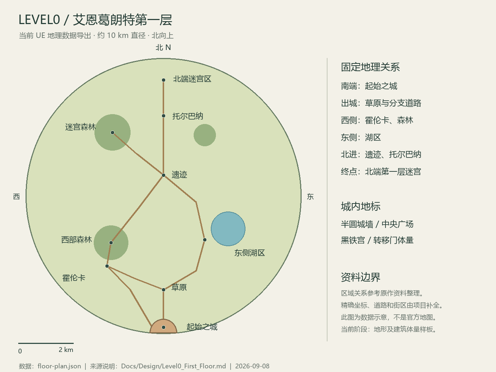
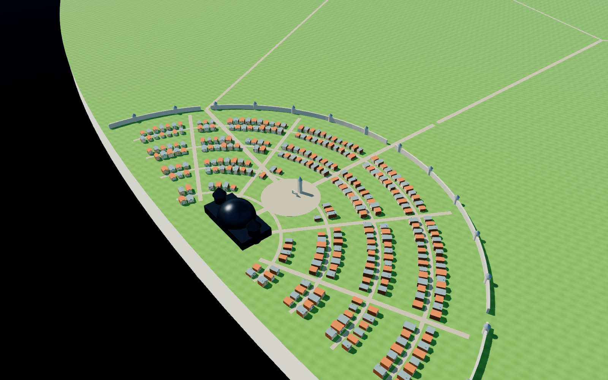

# Level0 第一层样板验收 · 2026-09-08

按用户“新建 SAO 世界，旧世界留档”的选择实施。当前交付是地图、建筑体量和独立持久档案基础；不是完整可玩的第一层，也没有宣称居民已自行生活或施工。

## 实机与地图

示意图由 UE 导出的 `floor-plan.json` 绘制，坐标来自实际实现；植被色块仅帮助读图。区域关系参考资料，精确坐标由项目补全，不是官方测绘图。来源及设定边界见 [设计文档](../../Design/Level0_First_Floor.md)。

其余未修改的 UE 原生画面：[整层](floor.png)、[广场](plaza.png)、[霍伦卡](horunka.png)、[托尔巴纳](tolbana.png)。每张图片有同名 `.png.json` 记录世界 ID、协调者相机、FOV、建筑和树木实例数。全层共 348 个建筑体量、3977 个树木实例；这些不是自主施工记录。

## 存档与运行

- 新地图：`/Game/ThreeHearths/Maps/L_AincradLevel0`，项目默认地图和 GameMode 已切换。
- 新世界 ID：`F4390752-4A07-7DE7-FACD-32BAC6F72C54`，13 位原创本地居民档案。身份、人设、故事在重启前后逐项一致。
- 最近运行 40 秒正常结束，世界累计时间从 85.062 秒增长到 125.183 秒。
- `MedievalShowcase/world.json` 与 `history.json` 内容未变；归档 `Archives/Medieval_20260908_81BDF793/` 与原件哈希一致，详见 `verification.json`。
- 原生编译 `level0-build06` 成功；4 项地理、3 项持久档案、2 项旧社会/持久化回归测试全部通过，零失败、零警告、零待运行。
- 新地图已保存编辑器预览，重新打开可直接看到地形和建筑体量。较大 `.umap` 单独启用 Git LFS；本轮未提交、未推送。

## 真实 Kimi 验证

本轮两次真实 `kimi-k2.6` 看图调用，新增费用合计 0.0128810 元，沿用现有账本。输入为 UE 原生 512×512 协调者截图，无截图修改；不是 NPC FOV，也不是居民决策。

第一轮提出黑铁宫应有深色金属区分，已新增实际 UE 金属材质并应用。第二轮确认宫殿与暖色民居的深浅区分，同时明确仍为占位体量。初轮涉及旧高台的表述无图像/新地图数据支撑，未采纳。

两次请求、输入图、输入哈希、原始响应、费用差额均保存在本目录 `kimi-coordinator*.json` 与相应图片。世界未由审阅请求直接修改。

## 当前边界及下一步

建筑没有完整内部、可用门和碰撞；湖水、植被、城墙、黑铁宫、迷宫仍需美术迭代。13 位居民仅为档案，住所 ID 尚未绑定场景产权，不存在已接通的角色活动和自身 FOV 决策。安全区是区域标记；战斗、剑技、商店 AI、任务和转移尚未实现。

下一阶段先完成起始之城一段可步行的样板街，再绑定固定居民的居所、工作、个人视野与真实 Kimi 请求，完成“需要 → 审核 → 暂停补功能/资产 → 原档恢复 → 实际使用”的一个闭环。原作地理和规则约束保持稳定。

启动：`Tools/Run-AincradLevel0.ps1`；1–5 切换视点，WASD/QE 移动，右键转向，Shift 加速。普通启动不进行 API 调用。
