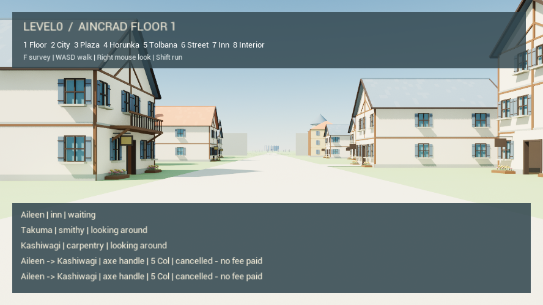

# 同一世界的委托事件与三方复核

继续 `codex/organic-village-20260907` 的 46a4e57 和同一 SAO 世界 `F4390752-4A07-7DE7-FACD-32BAC6F72C54`，保留 13 个身份，仅艾琳、拓真、柏木活跃。本轮没有新建世界、删除取消历史或重置预算。

## 根的选择

[三方讨论与取舍](../../Design/Life_Council_2026-09-08.md)确定：先让一件自主委托可回应、可取消、可追踪，然后继续验证实际交付、修理、取回、使用。路线仍是生活委托 → 经历影响下一次选择 → 同世界比较模型 → 真实需求驱动能力安装。城市扩展与完整角色美术随后逐步加入。

根负责真实 UE/Kimi、集成与玩家界面；Luna 连续性代理实现有界事件资格与原生测试；自主性代理审查事件、隐私及物理交付；体验代理审查可读性并记录讨论。代理意见经过交叉修正，不以投票替代根的判断。

## 开发前真实运行

`town-20260908-141201` 配置 240 秒，10 次真实 Kimi 请求全部结算，费用 **0.2144092 元**，没有新增未决请求。

艾琳向柏木提出 5 Col 修柄，约 7 秒后取消；随后又提出并取消。两个合同均保留为 cancelled，斧头刃/柄仍为 20/20，工具保管人、钱和材料都未改变。柏木起初还在回木工房途中。第二次提案时，他已选择“行，我接”，但回复于 14:12:44.972 UTC 返回，取消已在 14:12:44.020 生效；接单动作因合同不再合法而未执行，未预留费用。未完成送货或修理。

系统原来把发件人自己的收件副本也当成新消息，给了连续付费思考的机会；取消本身仍是 Kimi 的选择，不能保证消除自唤醒后就会成交。末次艾琳与柏木回应均提到两次取消，说明已发生的经历进入了后续个人上下文，但仍未证明长期人格或稳定关系。

`Kimi/` 保存十次原始请求、未经改动的本人视角 PNG、相机元数据、真实决策和结算收据；所有 PNG 已与原观察 SHA1 核对。原始世界保留在本机 Saved，`world-checkpoint.json` 是去除本机运行/账本引用的可移植副本。密钥和预算数据库不在本记录中。

## 本批修复

- 只检查 `seq > life_last_dispatched_inbox_seq` 范围内有资格的收件事件。外来事件及本人真实 `work/collect/use_tool` 结果可唤醒；本人发出的提议、接受、拒绝、取消、交付副本保留供记忆读取，但不自动再调用。
- 不通过过滤推进游标。实际派发仍保存请求的收件快照，期间新到消息留给下一次。普通思考保持至少 1800 秒现实冷却，重启不清除它。
- 根保留真实工作完成后的单次回访，即使当时没有另一项生活动作：居民对经历的观察和评价也是目标的一部分。重复工作仍受材料、合同状态和 operation 幂等约束。
- 玩家 HUD 显示三人的实际位置/动作和最近两笔合同的对象、修理部位、价格、阶段；不显示私人思考、关系或余额。显示沿用当前英文 HUD，中文人名对应 Aileen/艾琳、Takuma/拓真、Kashiwagi/柏木。
- 交接路线原会面点距岗位 190cm，到达容差 60cm，与双方 220cm 交接门槛不一致；改为 150cm 会面偏移、生活路线末点 5cm 容差。保留逐帧 sweep 行走与位置检查，不吸附或传送人物。对旧岗位 60cm 偏差仍有 5cm 交接余量，并保持大于双方 84cm 胶囊直径的最小间距。
- `--capture` 增加真实玩家视口 `player-hud.png`，独立于协调者场景图和 NPC 眼部图，便于验证提示是否实际可见。

## 尚未成立的部分

真实交付 → 修理 → 取回 → 使用仍需继续原档运行。原生测试中的人工摆位与 Apply 只验证规则，不能算 Kimi 自主成交。

三人的观察提到看不清或没看到工作台，但源码已有 `work_table` 模块，铁匠铺/木工房均有 `working_table` 配方实例。下一批应先核对本人朝向、工作点与现有台面的关系，避免把视野外的资产误判为不存在。艾琳在一条取消思考中误以为可收回提案费，而当时 reserved=0；执行器没有凭模型叙述退款，后续可补充动作费用语义的可读性。

编译通过；19 项 Aincrad 原生测试全部成功，无警告/失败。改后 60 秒启用 API 的冷恢复新增请求与费用均为 0，同一生活历史及冷却保留。最终字体复核的 35 秒原生运行通过门洞通行、墙体阻挡和 160cm 眼高检查。

## 改后真实回访

`town-20260908-144145` 在原档等待自然冷却到期，三人各进行一次真实决策，共 3 次，费用 **0.0724083 元**。艾琳选择等待，明确要避免再次反复；拓真、柏木选择观察。两笔已取消合同保留，没有新提案、修理、钱物转移。全轮累计 **13 次 / 0.2868175 元**，旧 6 笔未决预留保持不变。

此次回访支持“经历能影响下一选择”和“重启保留真实冷却”；它没有产生新提案，因此不能声称已在真实成交中验证过滤器。自提议/外来交错/结果事件资格由原生回归验证，实际交付和修理仍未成立。

`FollowupKimi/` 保存改后的原始观察和回应。核对源码发现生活模式的 `observe` 直接复用 `CaptureForDecision`，通常仍朝当前方向拍摄；两位工匠反复想看清工作台却不能主动环视。下一最小工作单元确定为：让观察能执行可核对的转头/扫视，保留实际眼位、遮挡、朝向与冷恢复，再由本人观察已有工作台，随后继续自主委托。不要因没有成交就删除这次等待选择，也不要直接批量补不存在的“缺失资产”。

运行元数据、原生测试、费用与几何验证在 `verification.json`。以上原生测试不代替真实交接验收。
