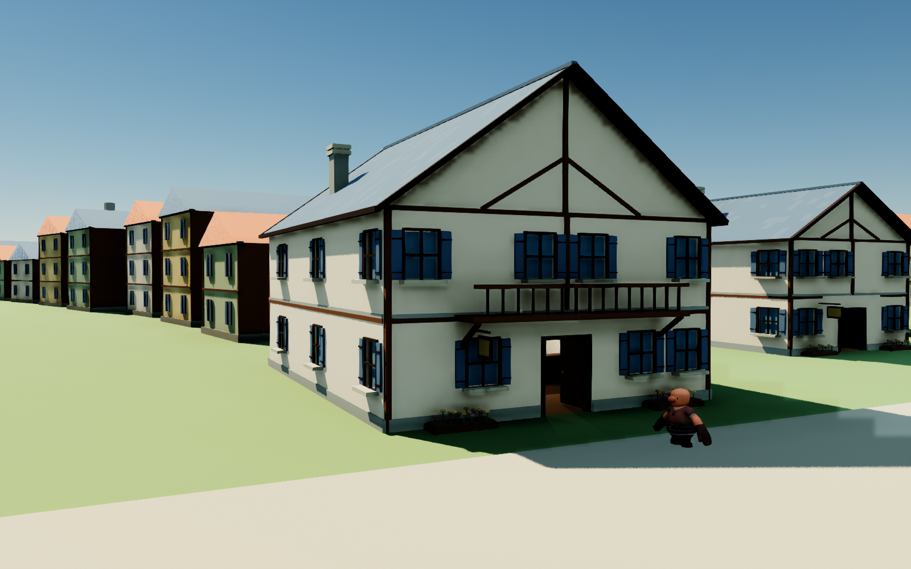
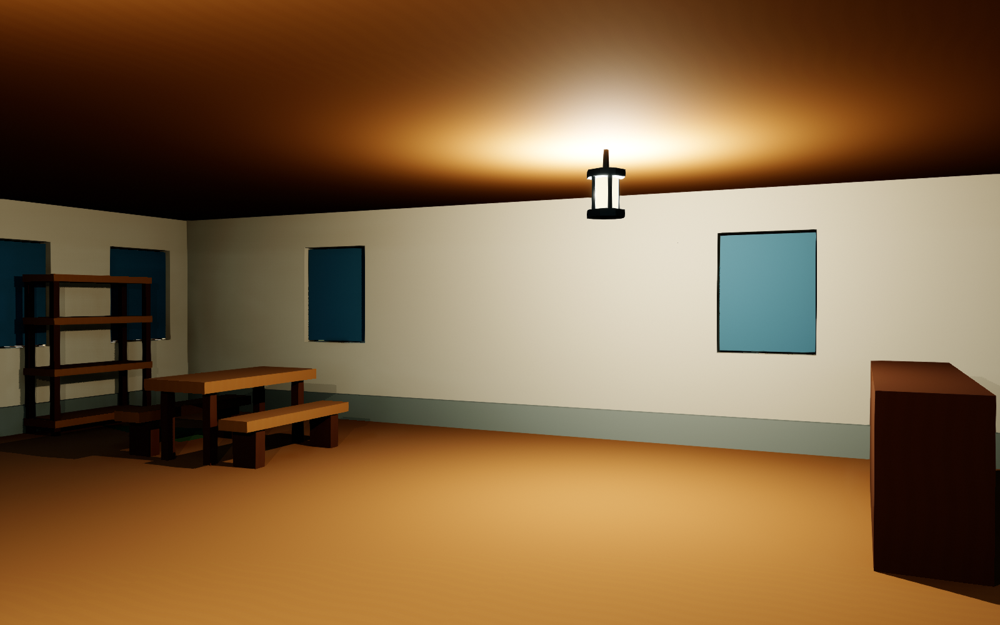

# 起始之城样板街 · 2026-09-08

本轮把第一层地理样板推进为一条有固定居民、可进入房屋和个人视野的街。沿用世界 `F4390752-4A07-7DE7-FACD-32BAC6F72C54`，没有重新生成人物。Luna 完成存档、街区与居民运行的主要工程；主代理负责模型、材质、接口审查、编译、UE 实测和纠偏。

## 实际画面与美术

[街景](After/starter-street.png) · [修改前旅店](Before/starter-inn.png) · [修改前室内](Before/inn-interior.png)。前后旅店与室内保持同一机位和曝光；街景机位移出树冠，不能作严格的固定机位对照。图片是 UE 直接导出的 PNG，没有修图或补画。

样板主街约 150m，12 栋两层/三层建筑。旅店、铁匠铺、木工作坊均有可进入一楼。墙、门窗、楼板和柱使用模块实例；屋顶、包边与部分家具使用细节批次。26 个 GLB 源导出均已导入原生资源，数量包含离线整栋检查模型，不等于 26 种玩法或 26 栋自主建成的房屋。

新增日式动画背景取向的灰泥、木石、蓝灰/陶土屋顶材质，以及行道树、庭院树、灌木、花槽、吊灯、长凳和货架。调整檐口、共享瓦片 UV、瓦色规律性、植物法线与室内亮度。标准见 [渲染与建模风格](../../Design/Starting_Town_Art_Style.md)。人物仍为临时旧骨骼形象，尚未完成二次元脸型、发型、服装及表情。

## 真实 NPC 决策

三人各提交一张在本人位置拍到的 512×512 原生图，眼位 1.60m、水平 FOV 85°。输入含本人长期故事、性格、当前场所、短期记忆和四种现有动作。三次请求时间重叠，属于独立并行请求。

| 居民 | Kimi 的实际选择 | 世界中的实际结果 | 尚未兑现的想法 |
| --- | --- | --- | --- |
| 艾琳 | `walk_to_work` | 穿过旅店入口，到达内部岗位 | 想积攒木料、扩充客房 |
| 拓真 | `walk_to_work` | 穿过铁匠铺入口，到达内部岗位 | 想修缮普通剑；目前没有待修物品和生产工序 |
| 柏木 | `observe` | 留在本人门前，重新观察 | 想积攒木材、让住所结实可靠 |

三人均表达了对屋内人员、工具或库存的不确定性，没有从未见区域读取全知状态。原始输入、提交图、响应、费用和事件分别在 [艾琳](Kimi/innkeeper/request.json)、[拓真](Kimi/blacksmith/request.json)、[柏木](Kimi/carpenter/request.json) 所在目录；`response.json` 是真实接口响应。`request.json` 的图片路径改为同目录便于查阅，其余个人输入及请求体哈希保留。

人工通行验证另行让三人到工作点、拍摄室内、经入口回到门前。每个人均记录实际到达、内部截图和侧墙阻挡胶囊；事件来源为 `local_verification`，不冒充 Kimi 选择。个人室内图：[艾琳](After/innkeeper-fov-interior.png)、[拓真](After/blacksmith-fov-interior.png)、[柏木](After/carpenter-fov-interior.png)。这些复查图未再次付费提交，不能宣称 Kimi 已认可改造后的室内。

## 持续性与验证

- v1→v2 迁移保留世界 ID、13 人全部原始字段、人设、故事、Col 与原住所引用；原 v1 文件保存在 `.pre-v2`，字节哈希与迁移前完全一致。
- 三人的建筑绑定、实际位置、完整路线、观察编号、Kimi 记忆及现实时间冷却持久保存。重启没有抬升楼层；新的建筑美术版本也不能绕过唯一派发入口的 1800 秒冷却。
- 世界快照见 [world-checkpoint.json](world-checkpoint.json)。它用于核对或经明确选择迁移到另一台机器，不自动覆盖已有存档；不含密钥，也不能代替费用账本。连续使用还要保留对应 `Observations` 下的原始经历和图片。
- `events.jsonl` 只作最近 64 条事件缓存；`history.jsonl` 追加保留完整原始事件，并保存决策内容。API 上下文仍只读短期记忆，长期事件检索尚未接通。
- 最终原生编译 `town-build08` 成功。`town-tests03` 的 13 项存档、迁移和街区/地理测试全部通过，无警告、失败或未运行项。此前出现过一次街区边界测试失败，已修复并通过复测。
- 实机验证了有效请求、行走碰撞、原档重启、个人截图和零新增收费。实际断网、超时回执、进程中断时的半途恢复尚未做故障注入测试，不能把代码中的防护等同于已完成全部异常验收。
- 旧中世纪归档的世界与历史文件哈希未变。详细字段比较、原生运行记录和费用见 [verification.json](verification.json)。

本批真实 Kimi 共 **3 次，0.0230235 元**，全部结算。两次带 API 开关的冷却内重启均为 0 次新增请求，无未决操作；本机城市账本累计 96 次、1.5998201 元。旧机未决负债 17.3692551 元仍单独计入启动预检，未清账、重建余额或新增授权。账本、guard、凭据留在本机 Saved，不进入交付文件。

UE/Blender/网关均按记录的自有 PID 结束，Luna 子任务已回收。本轮没有提交或推送。

## 剩余缺口与下一步

当前 13 人中只有三人活动，其余十人保留档案。建筑与家具由开发者制作和初始摆放，尚未产生居民自主施工。四种动作是行走到岗位、等待、观察、提出需求；“想修剑”和“想扩房”只是愿望。没有真实库存、购买、制造、社交交换、工单审批或安装闭环，空货架不具有存储功能。

环境也仍是第一版：支巷与货院未完成，普通住宅差异有限，职业店招还不够清楚，玻璃不透明，上层缺少可用楼梯与室内。玩家相机仍为自由飞行，局部居民路线使用胶囊扫掠和固定节点；不是全城 NavMesh、玩家步行或 VR 适配。没有测得 VR 帧时间，也没有宣称完成 SAO 式完全潜行或证明 NPC 具有意识。

接下来围绕已有反馈，先让木材、工具与 Col 有真实归属并完成一笔双方记忆可追溯的委托，再接“需求 → 审核 → 暂停实现 → 原档安装 → 使用回访”。同时以这条街补职业空间与二次元人物样板。阶段状态见 [执行计划](../../Design/Starting_Town_Iteration_Plan.md)。

直接查看：运行 `Tools/Run-AincradLevel0.ps1`，默认进入新街；数字 6 街景、7 旅店、8 室内，WASD/QE 移动、右键转向。普通启动不调用 API。有界验证工具为 `Tools/run_aincrad_residents.py`，明确 `--api` 才启动已有账本网关；`--exercise-routes` 只能与本地验证一起使用。
