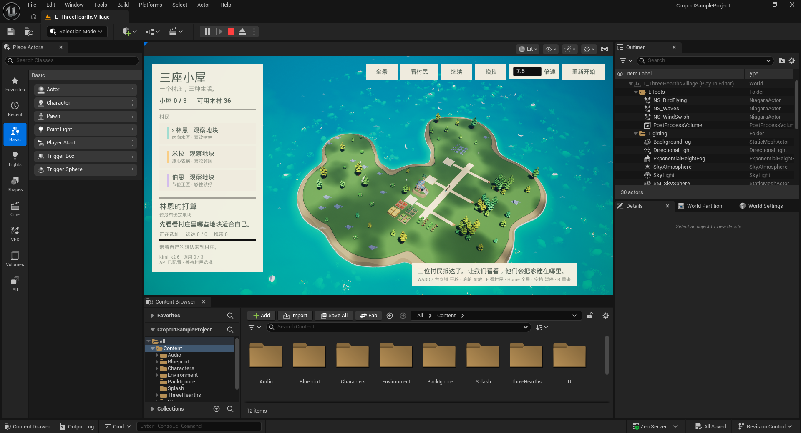

# Cropout 可用资源与模块清单

2026-09-05 · 按本机 `F:\CropoutSampleProject` 的资产注册表、建造数据表和职业数据表盘点。

**玩法中的经济资源是 3 类：食物、木材、石材。** 食物有 4 种农作物外观，加上灌木采集；它们在原项目中都计入 Food，没有自动成为 5 套独立库存。

盘点了原项目六个玩法/美术目录中的 **473 个资产条目**，以及 IslandGenerator 的 **9 个条目**，合计 **482 个**。这是文件级资产数量，包含材质、贴图、蓝图、音频及同名副本，不能理解成 482 种游戏资源。未计入引擎内容、编辑工具插件、新增 ThreeHearths 文件、生成缓存和地图文件。

[下载完整素材表](全部现有素材.csv)。每行列出了 UE 路径和本机文件位置。

## 1. 资源、作物与当前接入情况

| 经济资源 | 原项目已有来源 | 当前大地图 Demo | 下一步接入需要 |
| --- | --- | --- | --- |
| 木材 Wood | 树木、伐木职业、斧头、采集与交付任务 | 已有真实库存、搬运、伐木、再生、植树及建设消耗 | 后续可增加木材品类与加工 |
| 食物 Food | 灌木采集；玉米、小麦、生菜、南瓜四种农田 | 已接四种农田的播种、生长、收获、搬运与 Food 库存，以及浆果采集 | 饥饿、吃饭和食物分类尚未接入 |
| 石材 Stone | 石堆、矿工职业、镐、采矿动画 | 已接有限石矿、采石、搬运、Stone 库存和新住宅成本 | 后续可增加新矿点与加工 |

原有资源蓝图：`BP_Resource`、`BP_Tree`、`BP_Stone`、`BP_Shrub`、`BP_BaseCrop`，以及四个 `BP_Crop_*` 子类。它们依赖原生 GameMode、接口和库存；不能只拖进自定义 Demo 就假定生产链已经接通。

| 作物 | 模型数 | 原项目蓝图 |
| --- | ---: | --- |
| 玉米 | 4 个阶段 | `BP_Crop_Corn` |
| 小麦 | 4 个阶段 | `BP_Crop_Wheat` |
| 生菜 | 4 个阶段 | `BP_Crop_Lettuce` |
| 南瓜 | 4 个阶段 | `BP_Crop_Pumpkin` |

这些是 **4 种作物、16 个模型阶段**。生产版已接四种作物的播种、生长、成熟和收获；初始农田等待播种。

## 2. 环境和建筑素材：48 个静态模型条目

| 素材家族 | 条目数 | 用法与限制 |
| --- | ---: | --- |
| 房屋 `SM_House_01…04` | 4 | 一套房屋的不同建造阶段，现有三座小屋已使用；不是四套完全不同的房型 |
| 村镇中心 `SM_TownHall` | 1 | 已作为食物、木材、石材的公共交付点 |
| 纪念碑 `SM_Monument_01…06` | 6 | 原项目终局建筑的阶段素材，可改作村庄公共目标 |
| 桥梁 | 7 | 3 组桥头 + 3 组桥身，另有 1 个同名桥身副本；仍需连接地形和通行逻辑 |
| 四种作物 | 16 | 每种 4 阶段 |
| 树木 | 2 | 可组成树林；本轮已复用原生树形 |
| 灌木 | 2 | 可作为采集点和绿化 |
| 石堆 | 3 | 可做采石区，本轮已展示 |
| 草丛 | 4 | 场景点缀 |
| 水面 | 1 | 基础地图原有海水 |
| 背景雾网格 | 2 | 含不同目录下的同名条目 |

建造数据表 `DT_Buidables` 有 **8 个可放置条目**：灌木、树、房屋、纪念碑，以及四种农田。村镇中心是另一种原生建筑蓝图，不在这 8 个菜单条目内。

| 原菜单条目 | 原项目成本 |
| --- | --- |
| 灌木 | 食物 5 + 木材 2 |
| 树 | 食物 2 + 木材 5 |
| 房屋 | 木材 50 + 石材 5 |
| 纪念碑 | 木材 500 + 石材 500 |
| 四种农田，各自 | 食物 10 + 木材 10 |

这些数值来自原数据表。生产版新增建设已采用除纪念碑以外的配方；最初三座自住房保留 12 / 9 / 6 木材的轻量配方。纪念碑未开放。

## 3. 小人、职业、工具和动作

- **1 个村民主体模型**，配 **6 种发型 + 5 种职业帽子**，合计 12 个骨骼网格。可通过外观组合做更多村民，不等于已有 12 种不同人物骨架。
- **5 种工作角色 + 1 个空闲状态**：采集者、伐木工、矿工、农民、建筑工、空闲；来源是 `DT_Jobs` 的 6 行。
- **6 个工具静态模型**：斧头、篮子、木箱、锤子、锄头、镐。
- **9 个基础动画**：待机、走路、伐木、建造、搬运、耕作、采集、采矿、拾取。
- 另有 **6 个动画蒙太奇、3 个动画蓝图、2 个 Skeleton、10 个 PhysicsAsset**，用于组合动作和角色呈现。

当前 Demo 已接待机、走路、伐木、耕作、采集、采矿和建造动画；生产时根据工作切换职业帽子。三名村民都拥有全部技能，人设只影响选择偏好。

## 4. 已有玩法模块及复用难度

| 模块 | 原项目证据 | 当前状态 | 接入工作 |
| --- | --- | --- | --- |
| 岛屿与海岸 | `Village`、`BP_IslandGen`、`BP_Spawner`、水面/雾/鸟/风效果 | 本轮复用基础地图，固定保存当前岛形 | 当前路线经过陆地检查；全岛任意目标仍需导航接入 |
| 资源采集/交付 | `BT_CollectResource`、`BTT_Work`、`BTT_TransferResource`、`BTT_DeliverRessource` | 已统一三资源的采集、运输与交付 | 后续可扩展加工链 |
| 农田生产 | `BT_Farming`、`BTT_ProgressFarmingSeq`、四种作物蓝图 | 已接播种、生长、收获、搬运、库存 | 后续可扩展水分、肥力与季节 |
| 建造 | `BP_BuildingBase`、`BPC_House`、`BT_Build` | 已接初始自住房与新住宅、农田、植树和灌木配方 | 后续可扩展建筑类型 |
| 村镇中心 | `BPC_TownCenter` | 已作为公共物资交付点 | 人口增长与更复杂分工仍待接入 |
| 公共目标 | `BPC_EndGame`、纪念碑模型 | 未接，按用户要求排除 | 纪念碑不在可选任务中 |
| 职业切换 | `DT_Jobs`、`BP_Villager` | 三人共享全技能，工作时切换动画与帽子 | 人设影响高层工作选择 |
| 寻路与选点 | 4 棵行为树、4 个黑板、3 个 EQS，地图现有 NavMesh | 生产版已实现地面检查、18 块候选用地和避障路线 | 后续扩展任意位置建造与动态障碍 |
| 存档 | `BP_SaveGM`、`ST_SaveInteract`、`ST_Villager`、`BP_GI` | 原系统可参考；Demo 快照不能读档 | 为自定义人设、库存、房屋和任务补齐读写 |
| UI / 建造菜单 | 15 个 Widget Blueprint、CommonUI、输入映射 | Demo 使用自己的中文面板 | 可复用图标、成本显示和菜单交互思想 |
| AI 人设决策 | ThreeHearths 原生 HTTP 适配 | Kimi 已接入选址与持续生活；默认 6 秒间隔、每轮 60 次调用 | 后续增加生产与更复杂的社交行动 |

## 5. 其他现有素材数量

下面是原项目六个目录的统计，不含 IslandGenerator 的另外 9 项。

| 类别 | 数量 |
| --- | ---: |
| 静态模型 | 55：环境 48 + 工具 6 + 鸟模型 1 |
| 骨骼模型 | 12 |
| 基础动画 / 动画蒙太奇 / 动画蓝图 | 9 / 6 / 3 |
| 贴图 | 114 |
| 基础材质 / 材质实例 / 材质函数 | 23 / 44 / 3 |
| 普通 Blueprint | 55：玩法目录 46 + UI 样式等 9 |
| Widget Blueprint | 15 |
| 行为树 / 黑板 / EQS | 4 / 4 / 3 |
| Niagara 特效 | 6：鸟、冲击、困倦、目标指示、海浪、风 |
| 音频采样 SoundWave | 50 |
| MetaSound Source / Patch | 11 / 1 |
| 输入动作 / 输入映射上下文 | 6 / 4 |

其余条目为曲线、骨架、物理资产、结构体、枚举、数据表与音频控制等支撑素材；完整 473 项加岛屿 9 项都列在 CSV 中。

## 6. 这次加了什么

- 新地图 `/Game/ThreeHearths/Maps/L_ThreeHearthsVillage` 从原 `/Game/Village` 复制，保留海水、天空、环境效果和原始岛形。原始 `Village` 与旧小平台地图保留。
- 岛屿模型约 **145 × 151 米**，旧平台约 **24 × 21 米**。外接矩形面积约大 **43.6 倍**；海湾和缺口不算可走陆地，因此这不是精确陆地面积倍数。
- 三块住宅地和三处木材站分布在已检查的西侧陆地，仍由原来三个人设做选择并建房。
- 加入原生树林、灌木、石堆、四种农田、村镇中心，以及其他陆地上的环境点缀。生产版已接三类资源结算、农耕、采集与村镇中心交付。
- 新增 WASD / 方向键平移、滚轮大范围缩放、F / “看村民”定位、Home / “全景”查看整岛。镜头移动不受模拟倍速影响。
- 保留 Kimi 配置、1～1000 倍速、暂停和重开；生活版每轮默认 60 次调用，生活决策按真实时间限速。

验证结果：大岛上三座房屋全部建成，木材剩余 9、总量 36，地块未重复占用。对不同地块/木材站/村民通路组合及住宅、农田边角检查了 749 个点，均落在平坦陆地；全景、定位、平移、缩放及其边界已检查。运行时能看到 16 个成熟农田拼块和 1 个公共菜园拼块。

## 7. 建议下一步添加的内容

| 顺序 | 功能 | 原因与可复用内容 |
| --- | --- | --- |
| 已完成 | 三类库存、农耕、资源采集、地块开垦与非纪念碑建设 | 三名村民共享全部技能；生产记录进入完整历史 |
| 2 | 饥饿、食物消费与双向社交 | 已接入精力、休息、社交需求和任务结束后再次决策；饥饿与真正对话仍需新增 |
| 3 | 任意位置建造、道路规划、邻居偏好 | 当前已有候选地块检测与避障路线，可在此基础上扩展 |
| 4 | 村镇中心仓储与村民分工 | 协作、抢资源与公共建设会产生更明显的人设差异 |
| 5 | 游戏世界存档 | 已有完整决策历史保存与最近三次决定记忆；房屋、库存和关系状态仍不能读档恢复 |

铁、金币、布料、畜牧、渔业、战斗建筑等没有在本次盘点中找到完整的现成资源链，适合以后新增，不应当作原项目已经支持。当前素材为低多边形 3D；像素风仍需要额外的美术或渲染方案。

生产版完整规则与配方见 [生产与建设技能](生产与建设技能.md)。
